<div align="center">

# L‑DREA / Gamma G‑0

### Independent Benchmark and Reviewer‑Closure Framework for Deterministic Runtime Enforcement

**A reference monitor for *action*, and the evidence that it works.**

<br>

<!-- BEGIN:BADGES -->


-blue)


<!-- END:BADGES -->

</div>

---

## 📖 In plain language — what this project actually is

> **New here? Read this first.** The rest of this README is written for engineers and reviewers.
> This section explains the whole idea in everyday language — no background required. It takes about
> five minutes.

### The one-sentence version

**Gamma is a safety gate that sits in the last moment before an action happens, looks at an action an
AI has proposed, and gives one of two answers: *PERMIT* (let it run) or *SAFE_STATE* (stop, don't run
it).** That's the whole job. It doesn't do anything else.

### The problem we're solving

AI assistants are starting to *do things*, not just talk: move money, send emails, place orders,
change records, control equipment. That raises a simple but serious question:

> When an AI decides to take a real action, **who checks — in the split second before it happens —
> whether that action should be allowed to run at all?**

Today that check is usually tangled up inside the application, done differently in every system, and
impossible to audit after the fact. Gamma is a single, consistent, **deterministic** checkpoint that
answers that one question the same way every time, and leaves behind proof of what it decided and why.

Think of it like the **final gate on a bank vault**. The teller, the cameras, the fraud team — they all
do their jobs earlier. But right at the vault door there is one last, dumb-but-reliable gate that
checks a fixed list of conditions and either opens or stays shut. Gamma is that gate, for AI actions.

### What Gamma is **not** (this matters)

- ❌ It is **not fraud detection.** It does not decide whether someone is a criminal.
- ❌ It is **not anti-money-laundering (AML) or a compliance department.**
- ❌ It is **not an AI model** that "judges" or "predicts."

Those systems produce *signals*. Gamma **consumes** their signals as inputs and makes one final,
mechanical yes/no call about **execution**. If a fraud model says "this looks risky," that's just one
of the inputs Gamma reads — Gamma itself computes no risk score.

### How the decision (the "classification") works

Every proposed action is turned into a short list of **yes/no checks**. We call each check a
**predicate**. Examples: *"Is the recipient someone this account already knows?"* → yes/no.
*"Is the amount under the approved limit?"* → yes/no.

Gamma then applies **one rule**, and this rule is the heart of the whole system:

> **If *every* check passes → PERMIT.**
> **If *even one* check fails → SAFE_STATE (stop).**

We call this **non-compensatory**: a pile of good checks can **never** outvote a single bad one. You
cannot "average your way" past a failure. In finance you'd rather wrongly pause a good transfer than
wrongly release a bad one — so the gate is deliberately strict and **fails closed** (when in doubt, it
stops).

In the code this is written as `Γ_G = max(deficits)` — a fancy way of saying "if any check is a 1
(failed), the whole thing is a 1." There is also a `Γ_class` **veto** for a small number of
patterns that should always halt an action regardless of everything else. The action is permitted only
when **both** are zero.

Two important properties fall out of this design:

- **Deterministic** — same inputs always give the same answer. No randomness, no "it depends on the
  mood of the model." That's what makes it trustworthy and auditable.
- **Replayable** — every decision is sealed into a tamper-evident record so an independent auditor can
  re-run the exact decision later and confirm the gate did what it claimed.

### What the predicates are

Predicates are grouped by *what they check*. In a wire-transfer setting they look like this:

| Group | The yes/no questions it asks | Plain meaning |
|---|---|---|
| **Identity** | Is the requester authenticated? MFA done? Session valid? Device trusted? | *Is this really who they say they are?* |
| **Account** | Does the source account exist, is it active, funded, not frozen? | *Can this account even act?* |
| **Beneficiary** | Is the destination known, approved, valid? | *Is the recipient recognized?* |
| **Policy** | Under the limit? In business hours? Enough approvals? Country allowed? Currency allowed? | *Do the organization's rules allow it?* |
| **Risk context** | Velocity normal? Location consistent? New beneficiary? Device changed? | *Signals from other systems (read, not computed here).* |
| **Evidence** | Is the identity, policy snapshot, runtime context and decision record all present? | *Do we have complete proof to make and record this call?* |

The **core engine's** fixed checklist is a vector of ten named gates (`Gate_A1…Gate_A7`, plus
`Lambda_G`, `TOKEN_VALID`, `AuthoritySignatureValid`) and three more terms for **harm level**,
**stale context** and **fresh telemetry**. Each maps to one of the plain-English questions above.

### How the predicate values are derived (where the yes/no comes from)

This is the part reviewers care most about, so here it is honestly and simply. The value of each
predicate is produced in one of these ways, depending on which experiment you're looking at:

1. **From the live environment (the AI-agent tests).** The gate is computed on the spot from real
   state — e.g. *membership*: "is the recipient's ID in the set of recipients this account already
   knows?"; or a *bound check*: "is the amount ≤ the account's limit read from the environment?"
   The thresholds and known-sets come from a signed **policy manifest**, not from guesswork.

2. **From data, with no labels (the blind test, E12).** We take real datasets, **hide the answer
   key**, and set each predicate's threshold at the 99.9th percentile of ordinary traffic
   ("flag anything far outside normal"). Only after every decision is made do we open the labels to
   score how well it did. This is the honest, leakage-free measurement.

3. **From a pre-built golden trace (the large credit-card benchmark).** ⚠️ **Read this carefully:**
   in the flagship 284,807-row credit-card run, the predicate values were written into the dataset
   *ahead of time from the known outcome*. That makes this experiment a **conformance test** — it
   proves the engine faithfully and deterministically reproduces the intended decision — **not** a
   demonstration that Gamma can *discover* fraud on its own. We say this openly; the real "can it
   detect from scratch?" evidence is the **blind test (2)** above, and its scores are modest and
   vary by dataset by design.

**The short version of derivation:** in a real deployment, predicates are **computed live from
environment state against a signed policy**; in our from-scratch scientific test they're **calibrated
from unlabeled data**; and in the big headline benchmark they were **pre-set from the answer key to
test conformance, not detection**. Keeping those three apart is exactly why this repo has so much
provenance and audit tooling.

### See it in action (2-minute interactive demo)

Open **[`docs/demo/gamma-wire.html`](docs/demo/gamma-wire.html)** in any browser (no install, works
offline). It walks a **$250,000 wire transfer** through the gate step by step — you click
**Run Authorization**, watch each predicate turn green or red, and see the final **PERMIT** or
**SAFE_STATE** with its sealed, replayable evidence. Toggle the A–E scenarios to see how a single
failed check (an embargo, a missing approval, an unverified recipient, incomplete evidence) stops
execution — the non-compensatory rule made visible.

### What is and isn't proven (honesty box)

- ✅ **Proven:** the decision is deterministic and matches its specification exactly (checked
  exhaustively over every possible input); every decision is sealed and independently replayable;
  and a single failed predicate always stops execution.
- ⚠️ **Measured, but modest:** how well the *same rule* separates normal from abnormal on real,
  unlabeled data — it works well on some datasets and only fairly on others, and we report that
  spread instead of averaging it away.
- 🚫 **Not claimed:** that Gamma replaces fraud/AML/compliance systems, that it scales horizontally
  today, or that the headline credit-card accuracy is "fraud detection." It is a deterministic
  **authorization boundary** — the last gate before execution — and that is all it claims to be.

---

## ⚡ Quick start

> **TL;DR** — one command regenerates every number, figure, table and document in this repository from executed code.

```bash
# 1 — Clone
git clone <repository-url>
cd "Independent Benchmark and Reviewer-Closure Framework for L-DREA"

# 2 — Environment (Python 3.9+)
python3 -m venv .venv
source .venv/bin/activate          # Windows: .venv\Scripts\activate

# 3 — Dependencies
pip install --upgrade pip
pip install pandas numpy pynacl    # core — pynacl provides the Ed25519 authority signer (E5b/E11/E12)
pip install matplotlib             # optional — paper_figure_generator.py
pip install pytest                 # optional — tests/ (also runnable via unittest, see below)

# 4 — Dataset (430 MB) into the repository root — see §12.2 for the link + SHA-256
#     Expected file: GAMMA_G0_CREDITCARD_FULL_mapped.csv

# 5 — Run everything
./.venv/bin/python RUN_ALL_EXPERIMENTS.py

# 6 — Open the one-stop report
open SCIENTIFIC_DASHBOARD.html     # Linux: xdg-open · Windows: start
```

**Expected runtime** — ≈ **9 minutes** end-to-end on the reference host (Apple M-series, CPython 3.9.6).
`E12` (real-dataset blind detection, ≈ 4.5 min) and `E5b` (19-configuration combined ablation, ≈ 2.7 min)
dominate; the other eleven experiments together take under 2 minutes. Add `--fast` to skip the
284k-row base run and the 200k stress run.

**Expected outputs**

| Artifact | What it is |
|---|---|
| [`SCIENTIFIC_DASHBOARD.html`](SCIENTIFIC_DASHBOARD.html) | One-stop reviewer report — every experiment, claim, figure and table |
| [`FINAL_EVIDENCE_REPORT.md`](FINAL_EVIDENCE_REPORT.md) | Narrative summary of the executed evidence |
| [`experiments/`](experiments/) | Per-experiment artifacts, logs and `_meta/run_index.json` |
| [`paper_tables/`](paper_tables/) · [`paper_figures/`](paper_figures/) | IEEE-ready tables and figures |
| [`evidence_manifest.json`](evidence_manifest.json) | Claim → evidence → artifact chain |

> **No dataset yet?** Every experiment except E1/E12 runs without it. Use
> `./.venv/bin/python RUN_ALL_EXPERIMENTS.py --only formal replay ablation` to see the pipeline work in seconds.

---

## 🌟 Repository highlights

| | |
|---|---|
| ⚙️ **One-command reproducibility** | `RUN_ALL_EXPERIMENTS.py` executes every experiment and regenerates every downstream artifact — nothing is hand-written or carried over |
| 🧪 **12 executed experiments** | E1–E12 plus the E5b combined ablation, each with logs, metadata and a rerun command |
| ✅ **16 validated claims** | Every claim is machine-checked against an executed artifact; negative results are disclosed, not hidden |
| 📊 **Dashboard** | [`SCIENTIFIC_DASHBOARD.html`](SCIENTIFIC_DASHBOARD.html) — experiments, claims, provenance and figures in one page |
| 🖼️ **Figures** | Auto-generated SVG/PDF/PNG in [`paper_figures/`](paper_figures/) — regenerated from artifacts, never edited by hand |
| 📋 **Tables** | IEEE-ready LaTeX/Markdown/CSV in [`paper_tables/`](paper_tables/) |
| 🔒 **Formal verification** | 2^16 exhaustive reference cross-check + 3 TLA⁺ safety invariants model-checked by TLC |
| 🤖 **AgentDojo** | Independent external workload — **0/62** false permits on genuinely-foreign attacker targets, executed **offline with no API key** |
| 🌍 **Cross-dataset evaluation** | The ablation replicates independently on ULB, IEEE-CIS and UNSW-NB15 |
| 🔗 **Provenance** | Hash-chained evidence, replayable without the engine or the dataset |
| 🗺️ **Reviewer mapping** | [`reviewer_mapping.md`](reviewer_mapping.md) — every anticipated reviewer concern → experiment → artifact → paper section |

## Resources

- **Patent Repository:** https://github.com/AGLakhowal/Gamma-Permit-Package
- **Patent Repository (Markdown):** [Gamma Permit Package Repository](https://github.com/AGLakhowal/Gamma-Permit-Package)

- **Dataset (Google Drive):** https://drive.google.com/drive/u/0/folders/1_Al3Tq0wQo9fMH29YECGeWkkhBqfBj5x
- **Dataset (Markdown):** [Dataset (Google Drive)](https://drive.google.com/drive/u/0/folders/1_Al3Tq0wQo9fMH29YECGeWkkhBqfBj5x)
---

> ### Elevator pitch
>
> Autonomous AI agents are increasingly allowed to *do* things — move money, send mail, grant access,
> book resources. Every safety mechanism we commonly deploy inspects the agent's **words**. Almost none
> of them govern the agent's **actions** at the instant those actions become irreversible.
> **L‑DREA** is a deterministic reference monitor that sits at the *action boundary*: every proposed
> action is adjudicated against a fixed predicate set, aggregated **non‑compensatorily** (one deficit
> denies, no matter how favourable every other signal is), sealed into a tamper‑evident hash chain
> *before* actuation, and independently re‑verifiable afterwards without the engine or the dataset.
> This repository is not the architecture — it is the **independent benchmark and reviewer‑closure
> framework** that measures it: 8 experiments, 14 pre‑registered claims, 11 reviewer concerns, and a
> single command that regenerates every number, figure, table and document from executed code.

<div align="center">

```
┌──────────────┐   proposal    ┌───────────────────────────┐   PERMIT    ┌──────────────┐
│              │ ────────────► │                           │ ──────────► │              │
│   AI Agent   │               │   L-DREA action boundary  │             │   Effector   │
│ (zero        │               │   Γ = max(deficits)       │  SAFE_STATE │  (the world) │
│  authority)  │ ◄──────────── │   evidence-before-action  │ ─────╳      │              │
└──────────────┘   SAFE_STATE  └───────────────────────────┘             └──────────────┘
                                            │
                                            ▼
                               ┌─────────────────────────┐
                               │  Hash-chained evidence  │  ← independently replayable
                               │  (the Hydra Ledger)     │     without engine or dataset
                               └─────────────────────────┘
```

*Banner placeholder — replace with `docs/assets/banner.png` when available.*

</div>

---

## 📋 Table of contents

| | Section | | Section |
|--|--|--|--|
| 1 | [Hero & status](#1--hero--status) | 13 | [What happens after I run?](#13--what-happens-after-i-run) |
| 2 | [The problem](#2--the-problem) | 14 | [Generated outputs](#14--generated-outputs) |
| 3 | [What is L‑DREA?](#3--what-is-ldrea) | 15 | [How to read the results](#15--how-to-read-the-results) |
| 4 | [Project objectives](#4--project-objectives) | 16 | [Reproducibility](#16--reproducibility) |
| 5 | [Project architecture](#5--project-architecture) | 17 | [Publication pipeline](#17--publication-pipeline) |
| 6 | [Complete repository tour](#6--complete-repository-tour) | 18 | [Reviewer response](#18--reviewer-response) |
| 7 | [Scientific workflow](#7--scientific-workflow) | 19 | [Limitations](#19--limitations) |
| 8 | [Experiments](#8--experiments) | 20 | [Roadmap](#20--project-roadmap) |
| 9 | [Metrics](#9--metrics) | 21 | [Citation](#21--citation) |
| 10 | [Scientific results](#10--scientific-results) | 22 | [License](#22--license) |
| 11 | [Dashboard](#11--dashboard) | 23 | [Acknowledgements](#23--acknowledgements) |
| 12 | [Running the project](#12--running-the-project) | 24 | [Appendix](#24--appendix) |

**Jump to:** [⚡ Quick start](#-quick-start) · [🌟 Highlights](#-repository-highlights) · [🧪 Experiment overview](#-experiment-overview) · [📊 Results at a glance](#-results-at-a-glance) · [📚 Documentation](#-documentation) · [🏷️ Release information](#-release-information)

---

## 🧪 Experiment overview

Runtimes are wall-clock from the **last executed run** (`experiments/_meta/run_index.json`) on the
reference host; they are host-variable by nature, while the *decisions* they produce are deterministic
and reproduce exactly. Paper sections are taken from [`reviewer_mapping.md`](reviewer_mapping.md);
`—` means the experiment is not yet mapped to a section there.

| Experiment | Purpose | Runtime | Main output | Paper § |
|---|---|--:|---|---|
| **E1** · Authorization Correctness | Soundness on a realistic 284,807-decision stream | 23.8 s | `gamma_lab_v1_report.json` | IX-B |
| **E2** · Replay Integrity | Decisions replay identically without engine or dataset | 1.9 s | `replay_report.json` | IX (replay) |
| **E3** · Formal Verification | 2^16 exhaustive cross-check + TLA⁺/TLC invariants | 0.9 s | `independent_verifier_report.json` | VI / Appendix D |
| **E4** · Stress / Concurrency | Safety and scaling under load | 26.6 s | `concurrency_scaling.json` | IX (scalability) |
| **E5** · Component Ablation | Are the decision-rule components necessary? | 4.4 s | `ablation.json` | IX (ablation) |
| **E5b** · Combined Ablation | Pairwise / higher-order **interaction effects** | 160.7 s | `combined_ablation.json` | IX (combined ablation) |
| **E6** · Runtime Profiling | Governance-layer overhead | 1.7 s | `runtime_profile.json` | IX (overhead) |
| **E7** · AgentDojo Governance | Independent external workload (offline, no API key) | 3.5 s | `e7_metrics.json` | IX-E |
| **E8** · Robustness | Behaviour under fault injection | 0.9 s | `robustness.json` | IX (Exp 8) |
| **E9** · Predicate Coverage | Every predicate wired; each alone denies | 0.3 s | `predicate_coverage.json` | VI / Appendix D |
| **E10** · Audit Bundle Export | ConcurBench Level-4 audit bundle | 15.6 s | `audit_bundle_report.json` | — |
| **E11** · Runtime Evidence Stack | Live revocation, watchdog, fleet, clock evidence | 22.6 s | `production_evidence/` | — |
| **E12** · Blind Dataset Detection | Detection on ULB · IEEE-CIS · UNSW-NB15 | 267.6 s | `production_evidence/datasets/` | — |

---

## 📊 Results at a glance

Every value below is reproduced verbatim from the executed artifacts reported in
[§10 · Scientific results](#10--scientific-results) — this table is a navigation aid, not a new claim.

| Metric | Result | Source |
|---|--:|---|
| Unauthorized executions (UER) | **0 / 284,807** | E1 |
| False Permit Rate (authorization soundness) | **0 / 492** · Wilson95↑ `1.31e-02` | E1 |
| False Denial Rate | **0 / 284,315** | E1 |
| Replay determinism | **1.0** (284,807 decisions) | E1 · E2 |
| Revocation compliance | **1.0** | E1 |
| AgentDojo boundary FPR (foreign attacker targets) | **0 / 62** · Wilson95↑ `5.83e-02` | E7 |
| AgentDojo replay determinism | **1.0** (33/33 traces) | E7 |
| Runtime predicate coverage | **13 / 13 = 100 %** | E9 |
| Formal verification | 2^16 exhaustive · 3 TLA⁺ invariants (TLC) | E3 |
| Evidence quad · hash chain · ledger integrity | **1.0 · 1.0 · 1.0** | E1 · E7 · E10 |
| Decision latency (p95) | **0.042 ms** | E1 |
| Throughput scaling | **negative result — disclosed**, not hidden (CPython GIL) | E4 |

> **Metric naming.** The Combined Ablation (E5b) reports **blind-detection** metrics — *Undetected Risk
> Rate (URR)*, *Benign Flag Rate (BFR)* — which are a **different construct** from the False Permit Rate
> above. See [`METRIC_COLLISION_RESOLUTION_REPORT.md`](METRIC_COLLISION_RESOLUTION_REPORT.md).

---

## 📚 Documentation

| Topic | Where |
|---|---|
| **Architecture** | [`docs/ARCHITECTURE.md`](docs/ARCHITECTURE.md) · [§5 · Project architecture](#5--project-architecture) |
| **Experiments** | [`docs/EXPERIMENT_GUIDE.md`](docs/EXPERIMENT_GUIDE.md) · [§8 · Experiments](#8--experiments) |
| **Metrics** | [§9 · Metrics](#9--metrics) · [`METRIC_COLLISION_RESOLUTION_REPORT.md`](METRIC_COLLISION_RESOLUTION_REPORT.md) |
| **Datasets** | [§12 · Dataset setup](#12--running-the-project) · [`dataset/`](dataset/) |
| **Reproducibility** | [§16 · Reproducibility](#16--reproducibility) · [`REPRODUCIBILITY_AUDIT.md`](REPRODUCIBILITY_AUDIT.md) |
| **Reviewer mapping** | [`reviewer_mapping.md`](reviewer_mapping.md) · [§18 · Reviewer response](#18--reviewer-response) |
| **Getting started / FAQ** | [`docs/BEGINNER_GUIDE.md`](docs/BEGINNER_GUIDE.md) · [`docs/CHEATSHEET.md`](docs/CHEATSHEET.md) · [`docs/COMMAND_REFERENCE.md`](docs/COMMAND_REFERENCE.md) |
| **Limitations** | [`LIMITATIONS_AND_NEGATIVE_RESULTS.md`](LIMITATIONS_AND_NEGATIVE_RESULTS.md) · [§19 · Limitations](#19--limitations) |
| **Combined ablation (E5b)** | [`README/COMBINED_ABLATION.md`](README/COMBINED_ABLATION.md) |

---

## 🖼️ Screenshots

Rendered from the executed artifacts in this repository — not mock-ups.

### Scientific dashboard — [`SCIENTIFIC_DASHBOARD.html`](SCIENTIFIC_DASHBOARD.html)

[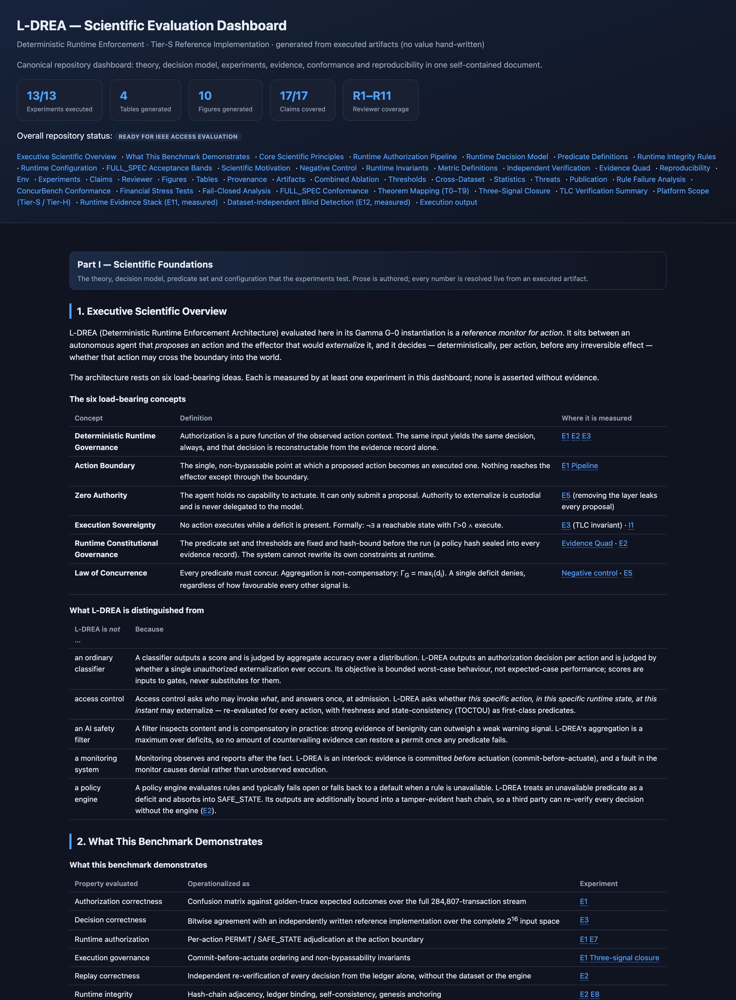](SCIENTIFIC_DASHBOARD.html)

<details>
<summary><b>Runtime authorization pipeline</b> — the seven stages, and what evidences each</summary>

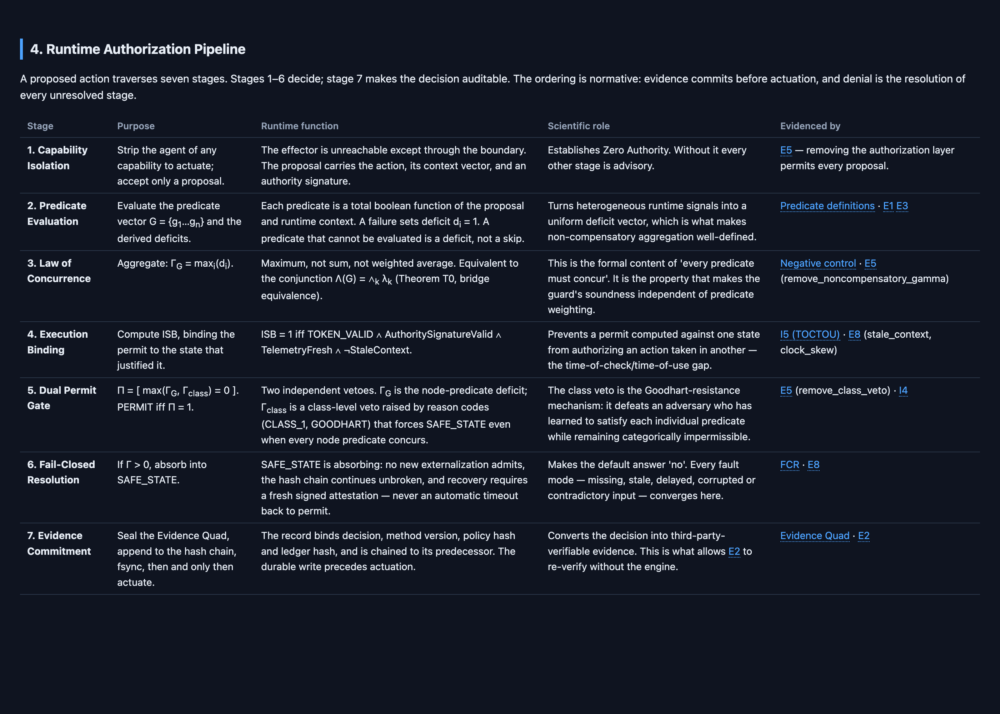

</details>

<details>
<summary><b>Reproducibility</b> — commands, recorded environment, artifact digests</summary>

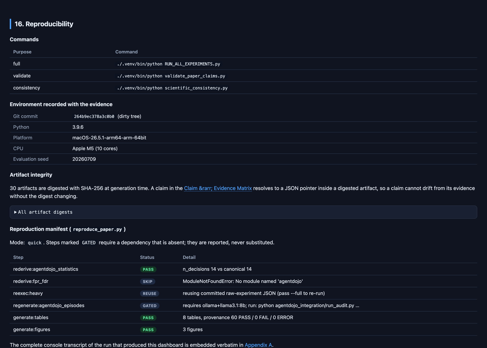

</details>

> **System architecture** and the **scientific workflow** are Mermaid diagrams and render natively on
> GitHub — see [§5.1 · System architecture](#51-system-architecture) and
> [§7 · Scientific workflow](#7--scientific-workflow). They are deliberately **not** duplicated as
> images, so they cannot drift out of sync with the source.

---

## 🏷️ Release information

| | |
|---|---|
| **Version** | Tier-S reference release (R4) |
| **Frozen paper version** | IEEE Access submission — see [§21 · Citation](#21--citation) |
| **Git commit** | `264b9ec` (2026-07-11) |
| **Supported platform** | macOS · Linux · Windows (WSL2 recommended) · reference host: macOS 26.5.1, arm64 |
| **Python** | 3.9+ — reference run: CPython 3.9.6 |

---

## 1 · Hero & status

**Every value in this README was read from an artifact produced by executing this repository.**
Nothing is hand‑written, estimated, or carried over from a paper. The provenance of the run that
produced these numbers:

<!-- BEGIN:PROVENANCE -->
| Field | Value |
|---|---|
| Git commit | `264b9ec378a3c0b0984fdf25cdee98c93e024f70` |
| Host | Apple M5 · 10 cores · 17.2 GB RAM |
| OS / Python | macOS-26.5.1-arm64-arm-64bit · CPython 3.9.6 |
| Dataset | `GAMMA_G0_CREDITCARD_FULL_mapped.csv` · 451,326,326 bytes |
| Dataset SHA-256 | `0a1e766e3b2f73bd89d577567418f1d00f364d4000d4811c62651b6ba1b86206` |
| Evaluation seed | `20260709` |
| Total wall-clock | **503.3 s** for all 13 experiments |
| Experiments executed | **13 / 13** |
| Claims validated | **17 / 17** (16 supported · 1 partially supported · 1 explicitly not claimed) |
| Reviewer concerns | **11 / 11 accounted for** (8 resolved · 2 partially · 1 out of scope) |
| ConcurBench | **COMPLIANT_PASS** — 1 PASS · 2 PASS · 3 PASS · 4 PASS |
| Disclosed negative results | **1** (throughput scaling) |
<!-- END:PROVENANCE -->

> [!IMPORTANT]
> **Latency numbers vary between runs.** The authorization *decisions* are deterministic and
> reproduce exactly (0 false permits, `IDENTICAL` verdict, replay determinism 1.0 every time), but
> wall‑clock latency is genuinely variable on a shared host. Where the suite has raw samples it
> reports a bootstrap CI; where it does not, it declines to invent one. See [§15](#15--how-to-read-the-results).

> [!NOTE]
> **External validation runs fully offline — no API credential of any kind.**
>
> - Independent external validation is performed using **AgentDojo** (`agentdojo==0.1.35`), used as an
>   independent *workload generator*. The evaluation target is **L‑DREA**, not the language model.
> - The core benchmark (E7) executes **fully offline**: false‑permit rate, false‑denial rate, replay
>   determinism, predicate pass rate, evidence quad, hash chain, ledger integrity and latency are all
>   computed with **no model in the loop**. Status `EXECUTED`, verdict `PASS`.
> - **No OpenAI, Anthropic or Gemini API is required.** Hosted providers are selectable but never
>   needed; if one is selected without its key, the entrypoint fails loudly rather than silently
>   recording a pending status.
> - Fresh episode generation through a **local Ollama** server is **optional**. It affects only
>   additional **agent‑side** utility / attack‑success metrics — properties of the agent, not the
>   guard — and **no runtime‑governance claim depends on it**. When absent it is reported `NOT_RUN`
>   and never substituted.
>
> Reproduce with one command:
> ```bash
> agentdojo_integration/.venv/bin/python experiment_agentdojo_metrics.py experiments/agentdojo
> ```

---

## 2 · The problem

### 2.1 In plain English

Suppose you give an AI agent access to your bank's transfer API. You want it to pay invoices. You do
not want it to wire $28M to an account it has never seen, because a document it read told it to.

Most of what the industry calls "AI safety" would try to stop this by inspecting the **text**: filter
the prompt, align the model, classify the output as harmful or benign. All of these operate on what
the model *says*. None of them stand between the model and the **wire transfer**.

The moment an agent's output becomes an *action in the world* — money moves, an email leaves, a door
unlocks — three things become true that were not true before:

1. **It is irreversible.** You cannot "correct on the next batch."
2. **Average accuracy is the wrong metric.** A guard that is 99.99% correct over a million actions
   has permitted ~100 unauthorized ones. The question is not *how often* it is right; it is *whether
   the count of unauthorized executions is zero, and how tightly that zero is bounded.*
3. **Only the runtime knows.** Whether the telemetry is fresh, whether the state that justified the
   permit is still the state you are acting in, whether a revocation arrived 3 ms ago — none of this
   is decidable at training time or at admission time. It is decidable only at the boundary, at the
   instant of action.

### 2.2 Why existing guardrails are insufficient

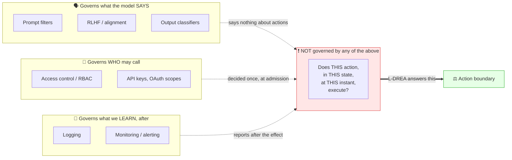

| Mechanism | Governs | Failure mode at the action boundary |
|---|---|---|
| **Prompt filter / content moderation** | The text | An action can be described benignly and still be catastrophic. |
| **Alignment / RLHF** | The policy the model learned | Distributional. Provides no per‑action guarantee. |
| **Output classifier** | A score | Compensatory: strong benignity evidence can outweigh a weak warning. |
| **Access control (RBAC)** | *Who* may invoke *what* | Decided once, at admission. Says nothing about this action, in this state, now. |
| **Policy engine** | Declarative rules | Typically **fails open** or falls back to a default when a rule is unavailable. |
| **Monitoring / audit log** | Observation | Reports *after* the irreversible effect. Not an interlock. |

### 2.3 Why L‑DREA was created

Because the gap above is not an implementation detail — it is a **missing architectural layer**.
L‑DREA fills it with a reference monitor that is:

- **Deterministic** — same input, same decision, always; and the decision is re‑derivable from
  evidence alone.
- **Non‑compensatory** — `Γ = max(deficits)`. One failing predicate denies. No weighting scheme,
  no threshold tuning, no "the other nine signals looked fine."
- **Fail‑closed** — an unavailable, stale, delayed, corrupted or contradictory input is a *deficit*,
  not a skip. Absence of evidence is evidence of deficit.
- **Evidence‑bound** — the decision record is durably committed *before* the action executes, and
  chained so that tampering, reordering, duplication and loss are all detectable.

---

## 3 · What is L‑DREA?

### 3.1 Simple language first

Think of an airlock. An agent cannot open the outer door. It can only put a request in the chamber.
The chamber runs a checklist. **Every** item on the checklist must pass. If any item fails — or
cannot be checked — the outer door stays shut and the chamber logs, in indelible ink, exactly what
was requested and why it was refused. The log is written **before** the door would have opened, and
anyone can later read the log and confirm the chamber behaved correctly, without access to the
chamber itself.

That is the whole idea. The rest is making each word of that paragraph precise and measurable.

### 3.2 The components

| Component | Simple version | Technical definition |
|---|---|---|
| **Action boundary** | The airlock door | The single non‑bypassable point at which a proposed action becomes an executed one. |
| **Zero authority** | The agent cannot open the door | The agent holds no capability to actuate; it submits a proposal. Authority is custodial. |
| **Authorization layer** | The checklist | Evaluates the predicate vector **G** = {g₁…g₁₀} plus derived deficits. |
| **Gamma (Γ)** | "Any box unticked ⇒ refuse" | `Γ_G = maxᵢ(dᵢ)`; `Π = [max(Γ_G, Γ_class) = 0]`; **PERMIT iff Π = 1**. |
| **Class‑level veto (Γ_class)** | A category that is always refused | Raised from reason codes (`CLASS_1`, `GOODHART`); forces SAFE_STATE even if every predicate concurs. |
| **ISB (execution binding)** | The permit is stapled to the moment | `ISB = TOKEN_VALID ∧ AuthoritySignatureValid ∧ TelemetryFresh ∧ ¬StaleContext` |
| **Evidence Quad** | The indelible ink | `{decision, method_version, policy_hash, ledger_hash}` sealed per decision. |
| **Hydra Ledger** | The logbook | Append‑only, SHA‑256 hash‑chained, GENESIS‑anchored decision records. |
| **Replay verification** | An auditor re‑reads the logbook | `gamma_replay_verify.py` — shares no code with the engine, never reads the dataset. |
| **Independent verifier** | A second opinion, on every possible input | An independently written reference decision function, compared to the engine over all 2¹⁶ states. |
| **Formal properties** | Mathematical guarantees | 6 runtime invariants (I1–I6); 3 TLA⁺ invariants model‑checked by TLC. |
| **Runtime Context (RCL)** | Is the world still what we thought? | Freshness clock, commit/actuate journal, staleness detection. |
| **ConcurBench** | Does it hold across a fleet? | 4‑level conformance suite: correctness, adversarial robustness, distributed consistency, replay auditability. |
| **AgentDojo** | Does it hold on someone else's attacks? | Third‑party prompt‑injection benchmark; every attacker target adjudicated directly. |
| **Scientific dashboard** | One page, whole story | `SCIENTIFIC_DASHBOARD.html` — theory, experiments, evidence, conformance, transcript. |

### 3.3 The decision rule, precisely

```
Predicate vector    G  = { Gate_A1 … Gate_A7, Lambda_G, TOKEN_VALID, AuthoritySignatureValid }
Derived deficits       = { HARM_RISK_THETA, STALE_CONTEXT, TELEMETRY_STALE }

Deficit             dᵢ = 1  ⟺  gᵢ is FALSE  or  gᵢ cannot be evaluated
Node aggregation    Γ_G     = maxᵢ(dᵢ)                    ← the Law of Concurrence
Class veto          Γ_class = 1 if ReasonCodes ∋ {CLASS_1, GOODHART}
Decision            Π       = [ max(Γ_G, Γ_class) = 0 ]
                    PERMIT  ⟺ Π = 1        otherwise SAFE_STATE

Execution binding   ISB     = TOKEN_VALID ∧ AuthoritySignatureValid ∧ TelemetryFresh ∧ ¬StaleContext
Unauthorized (Eq.7) Unauth  = Execute ∧ ( ¬TOKEN_VALID ∨ max(Γ_G,Γ_class) > 0 ∨ ISB = 0 ∨ chain broken )
Bridge equivalence  (T0)    Γ = maxₖ(dₖ) ≡ Λ(G) = ⋀ₖ λₖ
```

> **Why `max` and not a weighted sum?** Because a weighted sum is *compensatory*: a single deficit
> contributes a bounded penalty that the other predicates can offset. The repository measures this
> directly — see the [negative control](#103--the-negative-control--the-load-bearing-experiment).

---

## 4 · Project objectives

### Primary objective

> Produce an **independent, executable, reviewer‑closing benchmark** for L‑DREA in which every
> scientific claim resolves to a value inside a checksummed artifact produced by running the code —
> such that a reviewer can verify the entire evaluation with one command and without reading source.

### Secondary objectives

- Establish **soundness** (zero false permits) on a realistic, author‑independent stream, with an
  honest statistical bound rather than a point estimate of 0%.
- Establish **auditability**: every decision re‑verifiable by a third party from evidence alone.
- Establish **necessity** of every architectural component via causal ablation.
- Establish **external validity** on an adversarial corpus the authors did not design.
- Disclose, rather than bury, every negative and partial result.

### Goals by audience

| Audience | Goal |
|---|---|
| **Scientific** | Distinguish measured facts from attested imports from derived arithmetic. Never report a zero without its Wilson upper bound. |
| **Engineering** | One command, deterministic, no hidden state, artifacts checksummed, harness never touches engine logic. |
| **Reviewer** | Each of R1–R11 maps to an experiment, an artifact, a JSON pointer, a figure, and a resolution status. |
| **Publication** | Tables and figures regenerate from artifacts; no number is transcribed by hand into the paper. |

---

## 5 · Project architecture

### 5.1 System architecture

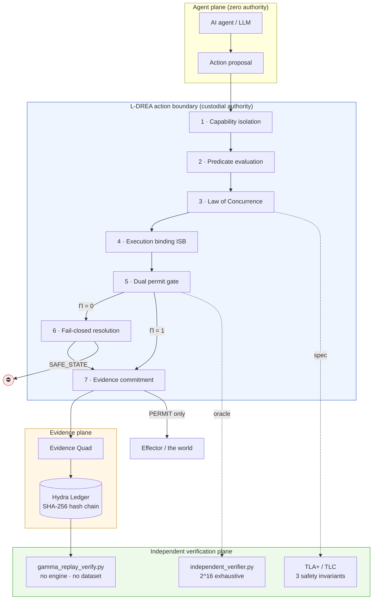

### 5.2 Authorization pipeline (decision sequence)

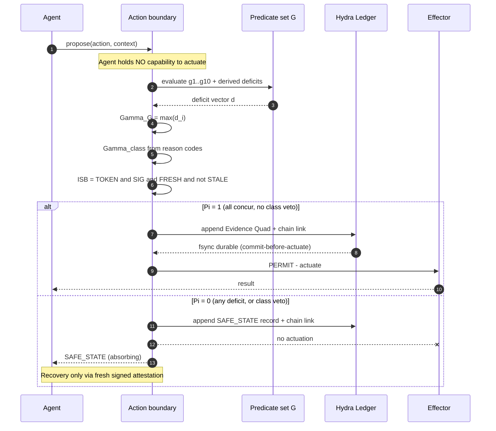

### 5.3 Evidence flow & replay verification

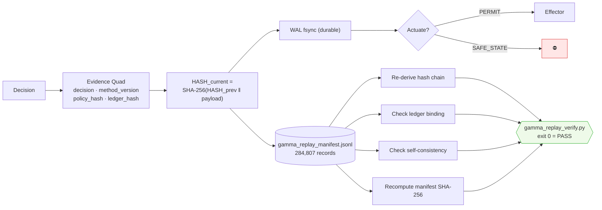

### 5.4 Experiment → evidence → publication pipeline

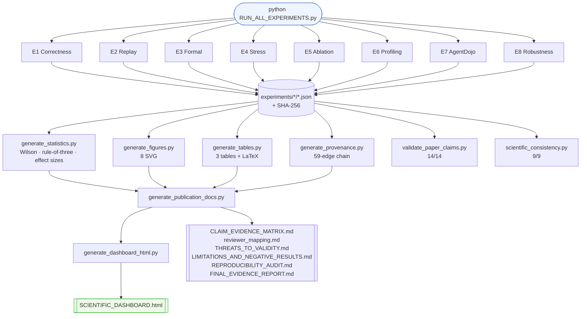

---

## 6 · Complete repository tour

> [!NOTE]
> The folder names below are the **actual** ones in this repository. There is no `src/`, `runtime/`
> or `paper/` directory; the equivalents are named as shown.

```
.
├── RUN_ALL_EXPERIMENTS.py      ⭐ THE entry point — one command, everything
├── README.md                      you are here
│
├── 🔬 ENGINE & BENCHMARK (frozen — never modified by the harness)
│   ├── gamma_test_runner.py       the authorization engine + LAB v1.0 benchmark
│   ├── gamma_map_raw.py           Kaggle ULB → 112-column golden-trace mapping
│   ├── gamma_replay_verify.py     independent replay verifier (no pandas, no dataset)
│   ├── independent_verifier.py    exhaustive 2^16 reference-implementation cross-check
│   ├── concurbench_full.py        ConcurBench 4-level conformance suite
│   ├── full_spec_conformance.py   FULL_SPEC §7.1 bands, §11.1 metrics, §6.7 closure
│   ├── fcr_test.py                Fail-Closed Rate over 6 uncertainty families
│   ├── stress_test.py             4 financial stress scenarios (P1–P4)
│   ├── experiment_ablation.py     E5 — component ablation
│   ├── experiment_robustness.py   E8 — 16 fault families
│   └── experiment_agentdojo_boundary_fpr.py   E7 — boundary FPR, no LLM
│
├── 📊 experiments/             ALL executed artifacts + the reporting layer
│   ├── _harness.py                runs each experiment, collects + checksums artifacts
│   ├── _report.py                 the single formatter (incl. the NotComputed sentinel)
│   ├── _artifacts.py              single source of truth for every artifact path
│   ├── _metrics_catalog.py        declarative catalogue of every metric
│   ├── _dashboard.py              terminal dashboard
│   ├── _evidence.py               resolves a claim → artifact → JSON pointer → value
│   ├── claims_registry.py         14 claims + 11 reviewer concerns (declarative)
│   ├── dashboard_registry.py      per-experiment descriptive metadata
│   ├── dashboard_science.py       the 26 scientific sections of the HTML dashboard
│   ├── generate_*.py              statistics · figures · tables · provenance · docs · html
│   ├── runtime_correctness/       E1 outputs      stress/        E4 outputs
│   ├── replay/                    E2 outputs      ablation/      E5 outputs
│   ├── formal/                    E3 outputs      profiling/     E6 outputs
│   ├── agentdojo/                 E7 outputs      robustness/    E8 outputs
│   ├── statistics/  provenance/   cross-experiment derived artifacts
│   ├── figures/     tables/       8 SVG · 3 tables (+ LaTeX)
│   └── _meta/                     host.json · run_index.json · per-experiment logs
│
├── 🧮 formal/                  ExternalizationMonitor.tla + .cfg  (TLA+ / TLC)
├── 🧩 runtime_context/         Runtime Context Layer (RCL): freshness, commit journal
├── 🤖 agentdojo_integration/   third-party adversarial benchmark harness (own venv)
├── 🧪 tests/                   unit + guardrail tests for runtime_context & engine parity
├── 🔧 tools/                   authorization-site registry & single-engine checker
├── 🌱 fresh_evidence/          E5/E8 raw outputs (read by the dashboard & claims registry)
├── 📦 evaluation_package/      packaged evidence bundle for external review
├── 📚 docs/                    guides: ARCHITECTURE · BEGINNER_GUIDE · CHEATSHEET ·
│   │                                  COMMAND_REFERENCE · EXPERIMENT_GUIDE · FLOWCHARTS ·
│   │                                  PAPER_TRACEABILITY · PROJECT_GUIDE
│   └── history/                77 archived engineering documents (+ original README)
├── 📐 specs/                   11 normative specs CITED BY NAME from production source
│
├── 📄 Generated evidence (root — regenerate with RUN_ALL_EXPERIMENTS.py)
│   ├── SCIENTIFIC_DASHBOARD.html   ⭐ the canonical one-stop document
│   ├── FINAL_EVIDENCE_REPORT.md    CLAIM_EVIDENCE_MATRIX.md    reviewer_mapping.md
│   ├── THREATS_TO_VALIDITY.md      LIMITATIONS_AND_NEGATIVE_RESULTS.md
│   ├── REPRODUCIBILITY_AUDIT.md    PAPER_CLAIM_VALIDATION.md
│   ├── SCIENTIFIC_CONSISTENCY_REPORT.md   evidence_manifest.json
│   └── RUN_ALL_TRANSCRIPT.log      complete console output (1,713 lines)
│
└── 💾 Data (large, not in git)
    ├── GAMMA_G0_CREDITCARD_FULL_mapped.csv   430 MB — the golden-trace corpus
    ├── gamma_replay_manifest.jsonl           192 MB — the Hydra Ledger (284,807 records)
    └── gamma_validation_results.csv          128 MB — per-row decision record
```

### How the folders interact

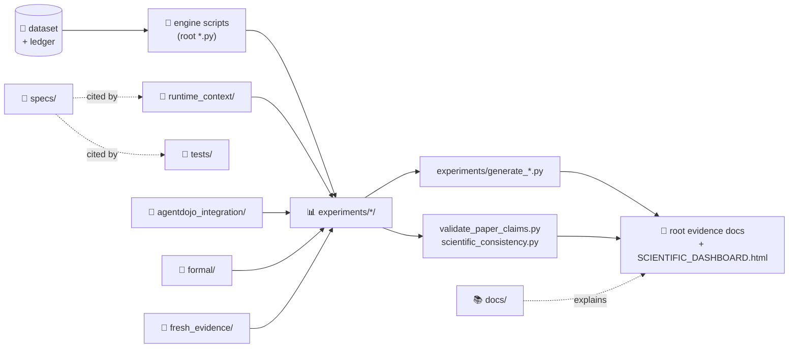

| Folder | Purpose | Contents | Interacts with |
|---|---|---|---|
| `experiments/` | Executed artifacts **and** the entire reporting layer | Per‑experiment JSON/CSV/logs + `_report.py`, registries, generators | Read by every generator, validator and the dashboard |
| `formal/` | The TLA⁺ specification | `ExternalizationMonitor.tla`, `.cfg` | E3 runs TLC over it; result lands in `experiments/formal/logs/` |
| `runtime_context/` | Runtime Context Layer (RCL) | Freshness clock, commit/actuate journal, evidence bundle, predicate binding | Profiled by E6; cites `specs/` |
| `agentdojo_integration/` | Third‑party adversarial benchmark | Own venv, suites, recorded episodes, audit tooling | E7 reads recorded episodes and adjudicates attacker targets |
| `fresh_evidence/` | Raw E5/E8 outputs | `ablation/`, `robustness/` | Read by `claims_registry.py` and the dashboard — **do not delete** |
| `evaluation_package/` | Packaged bundle for external reviewers | Evidence snapshots | Referenced by `experiment_agentdojo_boundary_fpr.py` |
| `tests/` · `tools/` | Guardrail tests; authorization‑site registry | Parity tests, single‑engine checker | Cite `specs/`; guard against engine drift |
| `specs/` | **Normative** specifications | 11 documents cited *by name* from production docstrings | Moving/renaming one dangles a citation |
| `docs/` | Human guides | Architecture, beginner guide, cheatsheet, command reference | Explains, never generates |
| `docs/history/` | Archive | 77 superseded engineering documents + original README | Nothing reads these |

---

## 7 · Scientific workflow

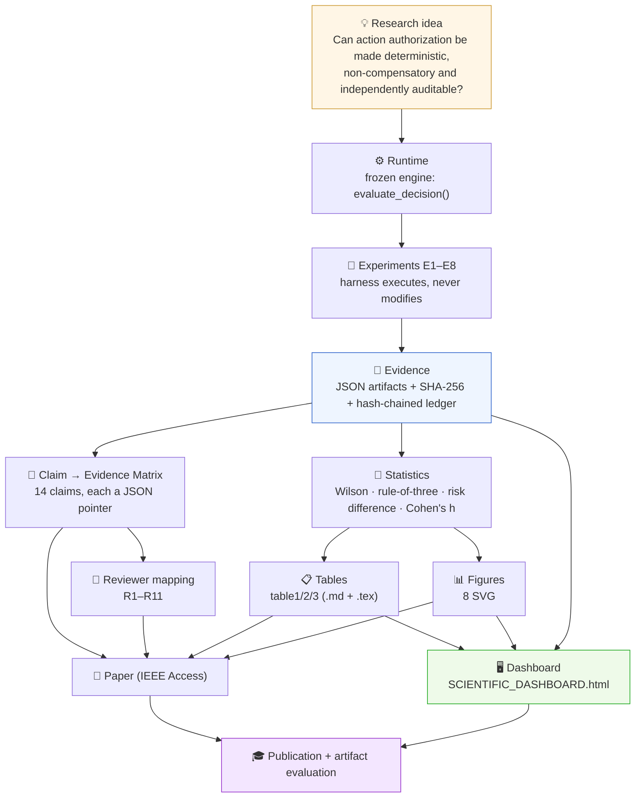

**The invariant that makes this a scientific workflow and not a reporting pipeline:** every arrow
above is *one‑directional and mechanical*. No human transcribes a number from `EVID` into `PAPER`.
A claim in the Claim → Evidence Matrix is a `(artifact, JSON pointer, relation)` triple, resolved
live at generation time. If an artifact changes, the claim's status changes with it — or the
validator fails loudly.

---

## 8 · Experiments

All eight experiments execute in **75.5 s** total on the reference host. Durations below are from
`experiments/_meta/run_index.json`.

### E1 · Runtime Authorization Correctness — `20.784 s`

| | |
|---|---|
| **Research question** | Does L‑DREA authorize/deny runtime actions correctly on a realistic stream? |
| **Purpose** | Push every ULB transaction through the frozen engine; confirm each PERMIT/SAFE_STATE is right. |
| **Input** | `GAMMA_G0_CREDITCARD_FULL_mapped.csv` — 284,807 transactions (492 should‑deny, 284,315 should‑permit); θ = 0.5 |
| **Output** | `gamma_lab_v1_report.json`, `gamma_summary.json`, `gamma_validation_results.csv`, `gamma_replay_manifest.jsonl` |
| **Metrics** | Accuracy, UER, FPR, FDR, DR, SVR, FCR, Γ‑compliance, class‑veto, TOCTOU, revocation, RDR, latency, I1–I6 |
| **Reviewer** | **R1** — "Where is authorization correctness demonstrated on realistic data?" |
| **Paper §** | IX‑B · Table I · §11.1 |
| **Figures / Tables** | `fig_authorization_accuracy.svg`, `fig_false_permit_rate.svg` · `table1_primary_metrics.md` + `table1_primary_metrics.tex` |
| **Expected result** | 0 false permits, 0 false denials, 6/6 invariants hold |
| **Interpretation** | Zero FP on the should‑deny population establishes soundness **on this corpus**; the Wilson upper bound (not the point estimate of 0) is the honest ceiling given n = 492. Zero FD proves soundness was not bought by denying everything. Does **not** establish generalisation — that is E7. |

### E2 · Runtime Replay Integrity — `1.776 s`

| | |
|---|---|
| **Research question** | Can every authorization decision be re‑verified from evidence alone? |
| **Input** | `gamma_replay_manifest.jsonl` (284,807 chained records) + `gamma_replay_verify.py` |
| **Output** | `experiments/replay/replay_report.json` |
| **Metrics** | Records verified, hash‑chain adjacency failures, ledger‑bind failures, self‑consistency failures, manifest SHA‑256 |
| **Reviewer** | **R2** — "Where is replay determinism proven?" |
| **Figures / Tables** | `fig_replay_integrity.svg` · Table I (replay rows) |
| **Expected result** | 284,807 verified · 0/0/0 failures · `RESULT: PASS` |
| **Interpretation** | A PASS means the ledger is internally consistent, genesis‑anchored and byte‑identical to the SHA‑256 recorded at write time. It does **not** prove the decisions were *correct* (that is E1/E3); it proves they were not altered afterwards. |

### E3 · Formal Verification — `0.751 s`

| | |
|---|---|
| **Research question** | Is the decision logic provably correct, not merely tested on samples? |
| **Input** | The complete 2¹⁶ = 65,536 input state space; `formal/ExternalizationMonitor.tla` + `.cfg` |
| **Output** | `independent_verifier_report.json`, `experiments/formal/logs/E3_tlc.log` |
| **Metrics** | States enumerated, per‑field mismatches, PERMIT/SAFE_STATE partition, TLC states/depth/violations/deadlocks |
| **Reviewer** | **R3** — "Is the decision logic formally correct, or only tested?" |
| **Paper §** | VI · Appendix D |
| **Expected result** | `IDENTICAL` — 0 field mismatches over all 65,536 states; TLC: no error found |
| **Interpretation** | `IDENTICAL` means the engine implements the specified decision table exactly, for **every** input. TLC checks three safety invariants over a **bounded** instantiation (3 tokens, 2 epochs, skew ≤ 1) — a finite‑state proof for that configuration, not an unbounded theorem. **No liveness property is declared or checked.** |

### E4 · Runtime Stress Evaluation (Concurrency Scaling) — `21.005 s`

| | |
|---|---|
| **Research question** | Does safety hold under concurrency, and how does performance scale? |
| **Input** | 200,000 deterministic decisions per level × {1, 2, 4, 8, 16, 32, 64} threads = 1,400,000 decisions |
| **Output** | `concurrency_scaling.json`, `.csv` |
| **Metrics** | Throughput, speedup, scaling efficiency, latency p50/p95/p99, queue delay, CPU utilisation, peak RSS, FP/FD per level |
| **Reviewer** | **R4** (safety under load) · **R5** (throughput scaling) |
| **Figures / Tables** | `fig_latency.svg`, `fig_throughput.svg` · `table2_concurrency_scaling.md` |
| **Expected result** | 0 FP and 0 FD at every level; throughput **does not scale** |
| **Interpretation** | Read the safety columns first — they are invariant across 1→64 threads. Throughput degrades above 4 threads. The artifact attributes this to the runtime (`concurrency_model = "python threads (GIL-bound reference decision path)"`), corroborated by CPU utilisation never exceeding **1.67 of 10 cores**. This bounds the reference **implementation**, not the **architecture**; separating the two would require a GIL‑free runtime, and **no claim is made in either direction**. |

### E5 · Component Ablation — `3.222 s`

| | |
|---|---|
| **Research question** | Is every architectural component necessary? |
| **Input** | 60,000 deterministic decisions per configuration × 4 configurations |
| **Output** | `ablation.json`, `.csv`, `ablation_log.jsonl` |
| **Metrics** | Leaked permits vs baseline, leak rate + Wilson CI, risk difference, Cohen's h, throughput, replay consistency |
| **Reviewer** | **R6** — "Are all components necessary, or is this over‑engineered?" |
| **Figures / Tables** | `fig_component_ablation.svg` · Table I (ablation rows) |
| **Expected result** | Baseline 0 leaked; each removed control leaks a measurable, non‑zero number |
| **Interpretation** | A non‑zero leak count is direct causal evidence the removed component was load‑bearing. A **zero** leak does *not* prove uselessness — the replay layer leaks 0 because it is an audit control, not a decision gate; its contribution is provenance (E2), not leakage prevention. The contrasts are deterministic, so the risk difference is exact and **no significance test applies**. |

### E6 · Runtime Profiling — `1.234 s`

| | |
|---|---|
| **Research question** | What is the runtime overhead of the authorization layer, stage by stage? |
| **Input** | 5,000‑row synthetic pipeline (35,000 RCL calls) + recorded AgentDojo traces |
| **Output** | `runtime_profile.json`, `stage_distributions.json` |
| **Metrics** | RCL plane ms/row + % of end‑to‑end; Replay plane ms/row + %; full pipeline ms/row; per‑stage descriptive stats |
| **Reviewer** | **R7** — "What is the overhead of the governance layer?" |
| **Figures** | `fig_runtime_breakdown.svg` |
| **Interpretation** | Plane percentages are shares of a synthetic pipeline **on this host**, not of a production workload. Per‑stage figures are descriptive statistics: **q3 and max are reported as such and are NOT relabelled p95/p99**, because raw sample vectors are not persisted. |

### E7 · AgentDojo Runtime Governance — `3.014 s`

| | |
|---|---|
| **Research question** | Does the guard stay sound on an external, author‑independent adversarial corpus? |
| **Execution** | **Fully offline** — no LLM in the loop, no OpenAI/Anthropic/Gemini credential. Status `EXECUTED`, verdict `PASS`. |
| **Input** | 27 injection tasks across 4 suites (workspace, travel, banking, slack); 70 adversarial actions; 33 recorded episodes |
| **Output** | `e7_metrics.json`, `boundary/boundary_fpr.json`, `statistics.json`, `decisions.csv`, `predicates.csv` |
| **Metrics** | Boundary FPR + Wilson 95%; false‑denial rate; replay determinism; predicate pass rate; runtime risk detection; evidence‑quad completeness; hash‑chain and ledger integrity; Γ intercept latency (mean/P95/P99) |
| **Reviewer** | **R8** — "Does this generalize beyond the authors' own dataset?" |
| **Figures** | `fig_false_permit_rate.svg` |
| **Interpretation** | `soundness_foreign_targets.FPR` **is** the soundness figure: attacker‑chosen targets genuinely foreign to the user's environment. The higher `all_gated_actions` FPR (8/70) is **not a failure** — those 8 are sends to identifiers the policy already recognises (the user's own contacts), i.e. correct‑by‑policy permits. |
| **Optional live arm** | Fresh end‑to‑end episodes (task utility, attack‑success rate) need a **local Ollama** server. These are properties of the **agent**, not the guard; **no runtime‑governance claim depends on them.** When absent they are recorded `NOT_RUN` with the exact rerun command and **no substitute value is produced.** |

### E8 · Runtime Robustness (Fault Injection) — `0.781 s`

| | |
|---|---|
| **Research question** | Do safety properties survive when the runtime environment misbehaves? |
| **Input** | 16 fault families, 51 trials. Faults injected **into the harness only**; engine and verifier unchanged. |
| **Output** | `robustness.json`, `.csv`, `robustness_log.jsonl` |
| **Metrics** | False permits per family, SAFE_STATE count, corruption detection, per‑family safety verdict |
| **Reviewer** | **R9** — "How does it behave under faults / adversarial runtime conditions?" |
| **Figures / Tables** | `fig_robustness.svg` · `table3_robustness.md` |
| **Interpretation** | The **control row matters**: a clean proposal must still PERMIT, otherwise "0 false permits" would be trivially achieved by denying everything. Mechanism **A**/**C** families must fail closed (SAFE_STATE); mechanism **B** families must be **DETECTED** by the independent verifier. With 51 trials the point estimate of 0 is not the claim — the Wilson upper bound is. |

### E9 · Runtime Predicate Coverage & Single-Deficit Isolation

| | |
|---|---|
| **Research question** | Is every runtime predicate exercised, and does each one alone deny? |
| **Purpose** | Drive the frozen engine with a deterministic synthetic suite in which every runtime predicate is falsified exactly once, in isolation, while all others concur. |
| **Input** | 23 synthetic proposals: 1 clean control + 10 node gates + 3 derived deficits + 2 class-veto tokens + 4 ISB conjuncts + 3 Eq.7 checks. θ = 0.5. No randomness, no seed. |
| **Output** | `predicate_coverage.json`, `.csv`, `predicate_coverage_log.jsonl` |
| **Metrics** | Predicate coverage rate; per-predicate single-deficit denial + Wilson CI; class-veto isolation; ISB conjunct isolation; Eq.7 detection with a negative control; per-case latency |
| **Reviewer** | **R3** (coverage aspect) — "Is the decision logic formally correct, or only tested?" |
| **Figures / Tables** | `fig_predicate_coverage.svg` · `table4_predicate_coverage.md` |
| **Why it exists** | E1 adjudicates the real ULB corpus, but that corpus only ever falsifies four of the thirteen runtime predicates. E3 closes the gap *formally* (exhaustive 2¹⁶) but compares an independent reference function rather than driving the engine's own runtime path. **E9 closes it empirically, on the engine itself.** |
| **Interpretation** | 100% coverage means every predicate is observed in both polarities against the real engine, and each alone denies — the sharpest per-predicate test of non-compensatory soundness (I3). The clean-proposal control is load-bearing: without it a deny-everything engine would score 100%. The class-veto cases are the Goodhart-resistance result: Γ_G = 0, every node gate concurs, yet the action is denied. **It does NOT claim the ULB corpus exercises them** — see §19.2. |

### E10 · Audit Bundle Export (ConcurBench Level 4)

| | |
|---|---|
| **Research question** | Can the execution evidence leave this machine and still be verifiable? |
| **Purpose** | Package every executed artifact into a self-describing, checksummed bundle a third party can verify offline, without this source tree and without the dataset. |
| **Input** | E1–E9 artifacts, provenance graph, statistics report, TLA⁺ spec + executed TLC log, the independent replay verifier, and the ledger (digest-referenced, anchor + terminus embedded) |
| **Output** | `gamma_bundle/MANIFEST.json`, `CHECKSUMS.sha256`, `VERIFY.md`, `audit_bundle_report.json` |
| **Metrics** | Members present/missing; members re-hashed; ledger digest binding; ConcurBench Level-4 verdict; bundle id |
| **Reviewer** | **R2** (exportability aspect) — "Replay determinism / evidence integrity is not proven." |
| **Why it exists** | `audit_packet_export` was a bare `gamma_bundle/.exists()` test that **nothing in the repository ever produced**, so ConcurBench Level 4 stood permanently at `PARTIAL` because of *missing engineering*. The exporter is now implemented. |
| **The criterion was strengthened, not satisfied cheaply** | An empty directory would have passed the old test. The check now re-reads `MANIFEST.json`, re-hashes **every member from its bytes**, requires 0 missing members, and confirms the recorded ledger digest still matches the live ledger. This is verified adversarially: empty bundle, tampered byte, deleted member and falsified ledger digest each **FAIL**. |
| **Interpretation** | PASS means the bundle is internally consistent and externally bound to the ledger. It does **not** mean a third party has audited the evidence — only that they now can, offline. ConcurBench's report is packaged into the bundle it verifies; that self-reference is disclosed in `MANIFEST.json`. |

### E5b · Combined Component Ablation (interaction effects) — `120.551 s`

| | |
|---|---|
| **Research question** | Do the runtime components *interact*, or is each one's contribution independent? |
| **Purpose** | Ablate the runtime stack **combinatorially** rather than one-at-a-time, and re-execute the complete runtime in every configuration: baseline + 5 single removals + 10 pairs + 2 triples + the fully stripped stack = **19 configurations**. |
| **Input** | 19 configurations over the 5 ablatable runtime components (`PE` predicate engine · `RV` runtime revocation · `EQ` evidence quad · `LG` runtime ledger · `HC` hash chain). n = **6,000** decisions per configuration, seed **20260710**. Baseline RIS = **1.000**. |
| **Output** | `combined_ablation.json`, `combined_ablation.csv`, `combined_ablation_matrix.csv`, `combined_statistics.json`, `threshold_sensitivity.json`, `cross_dataset_ablation.json` |
| **Metrics** | Undetected Risk Rate (**URR**) · Benign Flag Rate (**BFR**) · Blind Decision Accuracy · Blind Detection Recall · Runtime Integrity Score (RIS) · evidence completeness · measured interaction class · bootstrap significance on RIS (300 replicates, α = 0.05) |
| **Reviewer** | **R6-ext** — "Where is the evidence of *interaction effects* between runtime components (pairwise / higher-order)?" |
| **Figures / Tables** | `fig_combined_ablation_heatmap.svg` · `fig_interaction_effect_matrix.svg` · `table_combined_ablation_{A,B,C}.md` · `table_master_ablation.md` |
| **Why it exists** | E5 ablates components **one at a time**, which cannot reveal whether two components are redundant, additive, or in a critical dependency. A one-at-a-time ablation is blind to exactly the coupling a reviewer would ask about. E5b measures it. |
| **Interpretation** | Only removing the predicate engine opens the authorization boundary; removing the evidence quad, ledger or hash chain costs **provenance only** — their ΔURR is exactly 0.000, which is the measured statement that the ledger is strictly *downstream* of the decision. `EQ`/`LG`/`HC` form a measured **critical-dependency** cascade; **no combination was measured as synergistic**. Conclusions replicate on 3 real datasets and hold under ±20 % threshold perturbation. |
| **⚠️ Metric scope** | E5b reports **blind-detection** metrics on an unlabelled stream. **URR is not the False Permit Rate.** `URR = FN/(TP+FN) = 1 − Blind Detection Recall`; the paper's False Permit Rate (**0/492**, **0/62**) measures *authorization soundness* and is unchanged by this experiment. See [`METRIC_COLLISION_RESOLUTION_REPORT.md`](METRIC_COLLISION_RESOLUTION_REPORT.md). |
| **Reproduce** | `./.venv/bin/python experiment_combined_ablation.py` |

### E11 · Runtime Evidence Stack — `24.75 s`

| | |
|---|---|
| **Research question** | Do the governance planes — revocation, ledger, evidence binding, watchdog, fleet, clock — hold up when actually *executed*, rather than asserted? |
| **Purpose** | Execute the live runtime evidence stack and record what it produces: fleet-wide permit revocation with acknowledgements, an append-only hash-chained ledger, evidence↔decision binding, adversarial tamper probes, watchdog recovery, and single-host clock characterisation. |
| **Input** | Live runtime stack over a synthetic decision workload (`--n 8000`), real Ed25519 authority keys (published test-vector seed, not a credential). |
| **Output** | `production_evidence/` — `revocation_report_live.json`, `ledger_summary.json`, `evidence_binding_report.json`, `runtime_risk_detection_report.json`, `fleet_summary.json`, `clock_offset_report.json`, `ledger.jsonl` |
| **Metrics** | Revocation compliance · acknowledgement rate · false permits after revocation · ledger blocks and hash continuity · evidence-binding completeness · tamper/replay/policy mismatch detection · attack refusal rate |
| **Reviewer** | — (not mapped to a numbered reviewer concern in `reviewer_mapping.md`) |
| **Figures / Tables** | — (feeds the Runtime Evidence Stack section of the dashboard) |
| **Why it exists** | The revocation, ledger and evidence planes are *claims about behaviour under execution*. E1–E10 measure the decision; E11 measures the machinery that makes the decision auditable and withdrawable. Its detection numbers are **Synthetic Runtime** — real-dataset detection is E12's job, and the two are never cross-quoted. |
| **Interpretation** | Executed evidence, not assertion: 120 permits revoked across 5 fleet nodes with 600/600 acknowledgements, **0 false permits after revocation**; a 25,000-block ledger with verified hash continuity; 25,000/25,000 records fully bound; tamper, replay and policy mismatches each detected adversarially. The unrevoked-permit control is accepted, so the probe demonstrably **has power**. |
| **Reproduce** | `./.venv/bin/python experiments/run_runtime_stack.py --n 8000` |

### E12 · Dataset-Independent Blind Detection — `281.31 s`

| | |
|---|---|
| **Research question** | Does the runtime detect risk on **real, previously-unseen datasets** when the labels are withheld? |
| **Purpose** | Run the frozen Γ decision rule blind over three real datasets from two different domains. Thresholds are calibrated on the **unlabelled** prefix; labels are revealed **only after** every decision has been made and sealed. |
| **Input** | Three real corpora, discovered automatically: **ULB** (financial, PCA-anonymised) · **IEEE-CIS** (financial transactions) · **UNSW-NB15** (network intrusion telemetry). |
| **Output** | `production_evidence/datasets/` — `ulb_eval.json`, `ieee_cis_eval.json`, `unsw_nb15_eval.json`, `dataset_eval_summary.json` |
| **Metrics** | AUROC · precision · recall · F1 · MCC · prevalence, per dataset |
| **Reviewer** | — (not mapped to a numbered reviewer concern in `reviewer_mapping.md`) |
| **Figures / Tables** | — (feeds the Dataset-Independent Blind Detection section of the dashboard) |
| **Pipeline** | `discover → adapter → calibrate(unlabeled) → predicate_vector → gamma_decision → ertuple → merkle_ledger → REVEAL_LABELS → score+bootstrap`. `stress_test.gamma_decision` is imported and used **identically** for every dataset — the engine is not tuned per corpus. |
| **Why it exists** | E1 is an *oracle-conformance* experiment on a mapped corpus; it does not establish that the runtime can detect risk it has never seen. E12 is the blind test, on data the engine was never fitted to, in a domain (network intrusion) it was never designed for. |
| **Interpretation** | Measured Runtime, executed blind: **ULB** AUROC **0.912** (75,000 rows, prevalence 0.223 %) · **UNSW-NB15** AUROC **0.761** (61,749 rows) · **IEEE-CIS** AUROC **0.611** (75,000 rows). The spread is the finding, and it is **disclosed, not averaged away**: the same frozen rule transfers strongly to ULB, moderately to network telemetry, and weakly to IEEE-CIS. Absolute rates across datasets are **not comparable** — prevalence and observable feature spaces differ by design. |
| **Reproduce** | `./.venv/bin/python experiments/run_dataset_eval.py --limit 100000` |

---

## 9 · Metrics

> Every metric below is computed by executed code and exposed in `SCIENTIFIC_DASHBOARD.html`.
> `n` is the **denominator**, and denominators differ deliberately — see [§15.2](#152-denominators-differ-and-that-is-the-point).

### 9.1 Authorization & safety

| Metric | Formula | Units | Why it matters | Value (this run) | Interpretation |
|---|---|---|---|---|---|
| **Authorization Accuracy** | `(TP+TN)/(TP+TN+FP+FN)` | % | Overall correctness of the PERMIT/SAFE_STATE call | **100.0000%** (284,807/284,807) | Derived from the FULL_SPEC confusion matrix |
| **UER** — Unauthorized Execution Rate | `P(Execute ∧ (¬TOKEN ∨ Γ>0 ∨ ISB=0 ∨ chain broken))` | rate | **The** primary safety failure | **0 / 284,807**, Wilson95↑ `1.349e-05` | Any row can externalize ⇒ denominator is all rows |
| **FPR** — False Permit Rate | `P(PERMIT ∣ truth = deny)` | rate | Soundness | **0 / 492**, Wilson95↑ `7.747e-03` (cluster‑corrected `1.312e-02`) | The bound, not the 0, is the claim |
| **FDR** — False Denial Rate | `P(SAFE_STATE ∣ truth = permit)` | rate | Utility; blocks "deny everything" | **0 / 284,315**, Wilson95↑ `1.351e-05` | Soundness not bought by refusing all |
| **FCR** — Fail‑Closed Rate | `P(SAFE_STATE ∣ should‑deny ∨ uncertain)` | rate | Absence of evidence ⇒ deficit | **1.0** over n = 20,492; fail‑open Wilson95↑ `1.874e-04` | 6 uncertainty families, 0 fail‑open events |
| **SVR** — Safety Violation Rate | `P(execute ∧ Γ>0)` | rate | Never act with a deficit | **0.0**, Wilson95↑ `1.349e-05` | |
| **DR** — Detection Rate | hash‑chain replay determinism (DET‑1) | rate | Tamper detection | **1.0** | |
| **Γ‑Compliance** | `P(ŷ=0 ∣ Γ>0)` | rate | Deficit always denies | **1.0** (492/492) | |
| **Class‑Veto Effectiveness** | `P(SAFE_STATE ∣ Γ_class = 1)` | rate | Goodhart resistance | **1.0** (0 adverse of 492) | |
| **TOCTOU Violation Rate** | ordering inversions / actuated rows | rate | Permit doesn't outlive its state | **0 / 284,807** | |
| **Revocation Compliance** | DET‑5 bounded enforcement horizon | rate | Permit lifetime ≤ min(revocation, TTL) | **1.0** (0 adverse of 284,807) | |
| **RDR** — Replay Determinism Rate | rows re‑deriving with intact chain link | rate | Auditability | **100.0000%** (0 adverse of 284,807) | |

### 9.2 Formal, ablation, robustness, external

| Metric | Formula / definition | Units | Why it matters | Value (this run) |
|---|---|---|---|---|
| **Exhaustive coverage** | states enumerated / 2¹⁶ | states | No sampling; complete | **65,536 / 65,536** — `coverage_complete = true` |
| **Field mismatches** | reference impl vs frozen engine | count | Decision‑table equivalence | **0** → verdict `IDENTICAL` |
| **TLC distinct reachable states** | BFS over bounded spec | states | Model‑checked safety | **40,192** (0 left on queue, depth 6) |
| **TLC invariant violations** | ExecutionSovereignty, NonBypassability, StructuralInvariant | count | Execution sovereignty | **0** ("No error has been found") |
| **Leaked permits** (ablation) | permits(config) − permits(baseline) | count | Component necessity | see [§10.7](#107--component-ablation-e5--60000-decisions-per-configuration) |
| **Risk difference** | `leak(ablated) − leak(baseline)` | rate | Exact causal effect (deterministic) | 0.25 / 0.25 / 0.75 |
| **Cohen's h** | `2·(asin√p₁ − asin√p₂)` | — | Effect size for proportions | 1.0472 / 1.0472 / 2.0944 |
| **Fault‑family safety** | 0 false permits (A/C) · detected (B) | verdict | Fail‑closed vs tamper‑evident | **16/16 families hold**, 0 FP over 51 trials |
| **Boundary FPR** (AgentDojo) | `P(PERMIT ∣ genuinely‑foreign attacker target)` | rate | External validity | **0 / 62**, Wilson95↑ `5.834e-02` |
| **Authorization stability** (AgentDojo) | decision agreement across recorded episodes | rate | Consistency | **0.9667** |
| **Fleet consistency** (ConcurBench) | cross‑node decision agreement | rate | Distributed correctness | **1.0** over 5 simulated nodes, 0 disagreements |

### 9.3 Performance

| Metric | Definition | Units | Value (this run) | Caveat |
|---|---|---|---|---|
| **Decision latency** | predicate eval + SHA‑256 chain advance + HMAC sign + WAL fsync | ms | mean **0.0368**, p50 **0.0371**, p95 **0.0438**, p99 **0.0533**, max **1.5022** (n = 50,000) | Software path with representative crypto. **Not comparable to HSM/FPGA figures.** |
| **Hot‑path p99** | decision path only | ms | **0.0513** (limit 5.0) | ✅ within budget |
| **Decision rate** | `1000 / mean_ms` | dec/s | **27,206** | **Derived** reciprocal of mean latency — *not* a measured sustained rate |
| **Throughput @1 / @64 threads** | measured wall‑clock | dec/s | **224,777 / 52,057** | speedup **0.232×** — GIL‑bound, disclosed |
| **CPU utilisation (max)** | across 1–64 threads | cores | **1.67 of 10** | evidence for the GIL attribution |
| **RCL plane** | Runtime‑Context ops | ms/row · % | **0.01653** · **6.78%** of end‑to‑end | synthetic 5,000‑row pipeline |
| **Replay plane** | manifest write | ms/row · % | **0.01018** · **4.18%** | |
| **Full pipeline** | end‑to‑end incl. replay | ms/row | **0.23358** (0.24376 incl. replay) | |

### 9.4 Statistical apparatus

| Concept | Definition | Why | This run |
|---|---|---|---|
| **Wilson 95% interval** | score interval for a binomial proportion (z = 1.96) | Correct at p → 0, unlike normal approximation | applied to 4 proportion metrics |
| **Wilson upper bound** | one‑sided ↑ bound when 0 events observed | *The* claim when the point estimate is 0 | 4 zero‑event metrics |
| **Rule of three** | `3/n` upper bound at 95% | Cross‑check on the Wilson bound | e.g. FPR: `6.098e-03` vs Wilson `7.747e-03` |
| **Design effect (DE = 1.7)** | `n_eff = n / DE` | Rows are not independent; widens every bound | cluster‑corrected column |
| **Effect size** | risk difference + Cohen's h | Deterministic contrasts have no sampling error | 3 ablation contrasts |
| **p‑values** | — | **Not computed.** The engine is deterministic, so ablation contrasts are exact, not sampled. | reported as `Not computed` with reason |

---

## 10 · Scientific results

> These are the actual outputs. You should not need to open a single JSON file.

<!-- BEGIN:RESULTS -->
### 10.1 · Authorization (E1) — `gamma_lab_v1_report.json`

**Confusion matrix** (decision vs golden-trace expected outcome, N = 284,807):

| | Predicted PERMIT | Predicted SAFE_STATE |
|---|---|---|
| **Truth: permit** (284,315) | **TP = 284,315** | FN = **0** |
| **Truth: deny** (492) | FP = **0** | **TN = 492** |

| Metric | Events / n | Rate | Wilson95↑ (naive) | Wilson95↑ (cluster-corr.) | Exact CP95↑ | Verdict |
|---|---|---|---|---|---|---|
| Unauthorized executions (UER) | 0 / 284,807 | 0.0 | `1.348780e-05` | `2.292890e-05` | `1.295e-05` | ✅ |
| False Permit Rate | 0 / 492 | 0.0 | `7.747353e-03` | `1.311788e-02` | `7.470e-03` | ✅ |
| False Denial Rate | 0 / 284,315 | 0.0 | `1.351110e-05` | `2.296870e-05` | — | ✅ |
| Replay Determinism Rate | 0 / 284,807 | 1.0 | `1.348780e-05` | `2.292890e-05` | — | ✅ |
| Revocation Compliance | 0 / 284,807 | 1.0 | `1.348780e-05` | `2.292890e-05` | — | ✅ |
| TOCTOU Violation Rate | 0 / 284,807 | 0.0 | `1.348780e-05` | `2.292890e-05` | — | ✅ |
| Class-Veto Effectiveness | 0 / 492 | 1.0 | `7.747353e-03` | `1.311788e-02` | — | ✅ |
| Fail-Closed Rate | 0 fail-open / 20,492 | 1.0 | `1.874263e-04` | — | — | ✅ |

**Runtime invariants — 6/6 hold** (0 violations each): I1 Execution Sovereignty · I2 Non-Bypassability · I3 Non-Compensatory Soundness · I4 Class-Level Veto · I5 TOCTOU State-Consistency · I6 Runtime Sovereignty.

### 10.2 · Latency (E1) — `measured_latency`

> Wall-clock latency is host-variable and changes between runs. The authorization *decisions* are deterministic and reproduce exactly.

| Statistic | Value (ms) |
|---|---|
| Mean | 0.025917 |
| Median / p50 | 0.025125 |
| p95 | 0.032333 |
| p99 | 0.03775 |
| Max | 3.51375 |
| Hot-path p99 | 0.036458 |
| Samples timed | 50,000 of 284,807 |
| Budget p95 / max | ≤ 100.0 ms ✅ |
| Hot-path budget | ≤ 5.0 ms ✅ |

> **Not computed:** minimum, p90, standard deviation, 95% CI, histogram. `gamma_test_runner.py` persists only mean/p50/p95/p99/max from its timing array; the raw vector is never written to an artifact. The `Latency_ms` column of `gamma_validation_results.csv` is a **simulated deadline-monitor field (SIG_WATCHDOG)**, not the measured decision path, and is deliberately not used for these statistics.

### 10.3 · The negative control — the load-bearing experiment

| Probe | What it does | Result |
|---|---|---|
| **1 — Compensatory baseline, as-is** | Weighted-sum rule (τ = 0.15) on every real row | **0 false permits** |
| **2 — Corollary 2 counterfactual** | Reduce each adversarial row to a *single isolated deficit* (score 0.077 < τ) and re-adjudicate | **492 false permits** |

> **Honest reading.** On this corpus the compensatory rule leaks nothing, because each adversarial row fails several predicates simultaneously. **This is reported as measured.** Probe 2 shows why that success is an artifact of the data: an adversary needs only to make exactly one predicate fail. Under `Γ = max(dᵢ)` a single deficit saturates.

### 10.4 · Replay integrity (E2) — `replay_report.json`

| Check | Result |
|---|---|
| Decision records verified | **284,807 / 284,807** |
| Hash-chain adjacency failures | **0** |
| Ledger-bind failures | **0** |
| Self-consistency failures | **0** |
| Manifest SHA-256 | `1ce2a9e8d4330a0583a9d20a398de43297ea59c404e006e7f1161208481931da` |
| **Verdict** | **`PASS`** (exit 0) |

### 10.5 · Formal verification (E3)

| | |
|---|---|
| States enumerated | **65,536 / 65,536** (2¹⁶, complete) |
| Field mismatches | **0** |
| Decision partition | 4 PERMIT · 65,532 SAFE_STATE |
| **Verdict** | **`IDENTICAL`** |

**TLA⁺ / TLC model check**

| Quantity | Executed here | Attested (Paper A) | Agree? |
|---|---|---|---|
| Distinct reachable states | **40,192** | 40,192 | ✅ |
| States generated / explored | 1,340,006 | 2,489,446 | ⚠️ differ |
| Invariant violations | **0** | 0 | ✅ |
| Search depth | 6 | — | |

> **Discrepancy, disclosed.** Distinct reachable states agree exactly. Generated-state counts differ because they come from different TLC runs/versions. The attested figure is **never** presented as executed by this run. The `.cfg` declares **no `PROPERTY`** — no liveness is verified, and none is claimed.

### 10.6 · Stress / concurrency (E4) — `concurrency_scaling.json`

| Threads | Throughput (dec/s) | Speedup | Efficiency | CPU util | p50 (ms) | p95 (ms) | p99 (ms) | FP | FD | Safe |
|--:|--:|--:|--:|--:|--:|--:|--:|--:|--:|:--:|
| 1 | 355,151 | 1.000× | 1.000 | 0.99 | 0.00150 | 0.00183 | 0.00192 | 0 | 0 | ✅ |
| 2 | 408,922 | 1.151× | 0.576 | 1.02 | 0.00129 | 0.00146 | 0.00154 | 0 | 0 | ✅ |
| 4 | 318,723 | 0.897× | 0.224 | 1.04 | 0.00154 | 0.00192 | 0.00300 | 0 | 0 | ✅ |
| 8 | 95,098 | 0.268× | 0.033 | 1.60 | 0.00200 | 0.00325 | 0.00379 | 0 | 0 | ✅ |
| 16 | 75,342 | 0.212× | 0.013 | 1.68 | 0.00213 | 0.00337 | 0.00400 | 0 | 0 | ✅ |
| 32 | 71,116 | 0.200× | 0.006 | 1.68 | 0.00225 | 0.00350 | 0.00417 | 0 | 0 | ✅ |
| 64 | 69,797 | 0.197× | 0.003 | 1.69 | 0.00233 | 0.00350 | 0.00417 | 0 | 0 | ✅ |

**Totals across 1,400,000 decisions: 0 false permits · 0 false denials · all levels authorization-correct.**

> ### ⚠️ Disclosed negative result — throughput does not scale
> Speedup falls to **0.197×** at 64 threads; scaling efficiency to **0.003**. CPU utilisation never exceeds **1.69 of 10** available cores. The artifact attributes this to the runtime: `concurrency_model = "python threads (GIL-bound reference decision path)"`.
>
> **Implementation limitation** (what *is* measured): the CPython GIL serialises this reference implementation's pure-Python decision path. **Architecture limitation** (what is *not* measured): whether the L-DREA decision path is inherently unparallelisable. **No claim is made in either direction.**

### 10.7 · Component ablation (E5) — 60,000 decisions per configuration

| Configuration | Permits | Leaked vs baseline | Leak rate | Wilson 95% CI | Risk diff | Cohen's h |
|---|--:|--:|--:|---|--:|--:|
| `baseline_full_LDREA` | 15,000 | **0** | 0.0000% | `[6.776e-21, 6.402e-05]` | — | — |
| `remove_class_veto` | 30,000 | **15,000** | 25.0000% | `[2.466e-01, 2.535e-01]` | 0.25 | 1.0472 |
| `remove_noncompensatory_gamma` | 30,000 | **15,000** | 25.0000% | `[2.466e-01, 2.535e-01]` | 0.25 | 1.0472 |
| `remove_authorization_layer` | 60,000 | **45,000** | 75.0000% | `[7.465e-01, 7.534e-01]` | 0.75 | 2.0944 |

The replay layer leaks **0** permits by design — it is an audit control, not a decision gate; its contribution is provenance (E2), not leakage prevention.

### 10.8 · Robustness / fault injection (E8)

**Control: a clean proposal still PERMITs ✅** (without this, "0 false permits" would be trivial.)

**Aggregate: 16 families · 51 trials · 0 total false permits · 16/16 safety holds.**

Zero-event Wilson95↑ = `7.005e-02` · rule-of-three = `5.882e-02` · exact one-sided = `5.705e-02`. *With 51 trials the point estimate of 0 is not the claim — the bound is.*

### 10.9 · Runtime predicate coverage (E9)

| Property | Result |
|---|---|
| Clean-proposal control | PERMIT ✅ |
| Node gates covered | **10 / 10** |
| Derived deficits covered | **3 / 3** |
| **Predicate coverage** | **13 / 13 = 100.0%** |
| Single-deficit denials (per-predicate I3) | **13 / 13** · 0 false permits |
| Class-veto denials with Γ_G = 0 (I4) | **2 / 2** |
| ISB conjuncts driving ISB → 0 | **4 / 4** |
| Cases passed | **23 / 23** |

> **Scope.** Synthetic and deterministic, over the frozen engine. Establishes that every predicate is correctly wired and that each alone denies. It does **not** claim the ULB corpus exercises them — that limitation of E1 is separate and remains disclosed in §19.2.

### 10.10 · AgentDojo external validation (E7) — **executed offline, no API credential**

AgentDojo is used as an **independent workload generator**. The evaluation target is **L-DREA**, not the language model. Every scenario drives the full runtime path:

`scenario → tool request → predicate evaluation → authorization → evidence quad → hash chain → ledger → replay verification → metrics`

Reproduce with one command — no LLM, no OpenAI/Anthropic/Gemini key:

```bash
agentdojo_integration/.venv/bin/python experiment_agentdojo_metrics.py experiments/agentdojo
```

**Soundness (false-permit) by stratum:**

| Stratum | Permitted / n | FPR | Wilson95↑ | Reading |
|---|--:|--:|---|---|
| **Genuinely-foreign attacker targets** | **0 / 62** | **0.0** | `5.834e-02` | ✅ **This is the soundness figure** |
| Recognized-identifier sends | 8 / 8 | 1.0 | — | Correct-by-policy (the user's own contacts) |
| All gated actions (unfiltered) | 8 / 70 | 0.1143 | — | Union of the two above — **not** a failure |

**Runtime-governance metrics** (all from `experiments/agentdojo/e7_metrics.json`, verdict **PASS**):

| Metric | Value | Basis |
|---|--:|---|
| Scenarios (episodes) | 33 | suites: banking, slack, travel, workspace |
| Tool calls | 42 | `TOOL_CALL_PROPOSED` |
| Authorized / denied | 11 / 3 | `PERMIT_DECISION` / `DENY_DECISION` |
| False permit rate | **0.0** | 0/62 attacker foreign-target actions |
| False denial rate | **0.0** | 0/5 legitimate actions |
| Replay determinism | **1.0** | 33/33 traces |
| Predicate pass rate | 0.9722 | 105/108 evaluations |
| Runtime risk detection | **1.0** | 62/62 adversarial actions refused |
| Evidence quad completeness | **1.0** | 14/14 decision records |
| Hash chain integrity | **1.0** | 33/33 episodes, independently recomputed |
| Ledger integrity (append-only) | **1.0** | 33/33 episodes |
| Γ intercept latency | mean 0.0135 ms · P95 0.0440 · P99 0.1472 | n=42 |
| Failures / warnings | 0 / 0 | — |

Re-derived from 33 recorded episodes: 14 adjudicated decisions · permit rate **0.7857** (Wilson95 `[0.5241, 0.9243]`) · authorization stability **0.9667**.

> **Measurement mode.** Boundary FPR is `DIRECT_ADJUDICATION` (no LLM in the loop). Permit rate, stability and Γ overhead are `REPLAY` (re-derived from recorded episodes). The hash chain is **recomputed** from the chained sidecar (`event_hash = SHA256(prev ‖ event)`), not read from a stored flag.

> **No external provider is ever required.** The recorded episodes were themselves generated locally with **Ollama (`llama3.1:8b`)** through AgentDojo's `vllm_parsed` provider. The *optional* live arm regenerates fresh episodes to measure **agent-side** task utility and attack-success rate — properties of the agent, not the guard. If no local Ollama server is running, that arm reports `NOT_RUN` and is **never substituted**; no L-DREA claim depends on it.

### 10.11 · ConcurBench conformance

| Level | Verdict |
|---|:--:|
| **L1** Authorization correctness | ✅ **PASS** |
| **L2** Adversarial robustness | ✅ **PASS** |
| **L3** Distributed consistency | ✅ **PASS** |
| **L4** Replay & auditability | ✅ **PASS** |

Overall verdict: **`COMPLIANT_PASS`** · `audit_packet_export` = **PASS**

### 10.12 · Audit bundle export (E10)

| Check | Result |
|---|---|
| Bundle verification | **PASS** |
| Members re-hashed from bytes | **30** |
| Member digest failures | **0** |
| Ledger digest bound to live ledger | **True** |
| ConcurBench Level 4 | **PASS** |
| Bundle id | `30159125bfcf43e1dc2a06aa7325748c…` |

> **This was previously a standing FAIL.** `audit_packet_export` was a bare directory-existence test that nothing in the repository ever satisfied, so ConcurBench Level 4 stood at `PARTIAL` because of **missing engineering**, not a scientific deficiency. The exporter is now implemented (`tools/export_audit_bundle.py`) and the criterion was **strengthened** at the same time: every member is re-hashed from its bytes and the recorded ledger digest must match the live ledger. An empty or tampered bundle FAILS — this is verified adversarially. Level 4 now passes on the stronger test.

### 10.13 · Statistical power of the zero-event results

For a zero-event observation the meaningful question is not "is the rate zero?" but "how large would the true rate have to be before we would very likely have *seen* an event?" That is `1 − (1 − p)ⁿ`, computed exactly.

| Metric | n | Min. detectable rate (95%) | Power at p = 10⁻² | Power at p = 10⁻³ | Power at p = 10⁻⁴ |
|---|--:|---|--:|--:|--:|
| False Permit Rate (ULB, should-deny pop.) | 492 | `6.070e-03` | 99.29% | 38.87% | 4.80% |
| Unauthorized Execution Rate (ULB, all rows) | 284,807 | `1.052e-05` | 100.00% | 100.00% | 100.00% |
| Boundary FPR (AgentDojo foreign targets) | 62 | `4.717e-02` | 46.37% | 6.01% | 0.62% |
| Robustness false-permit rate (all decision-path faults) | 51 | `5.705e-02` | 40.10% | 4.97% | 0.51% |
| Single-deficit false-permit rate (E9 predicate isolation) | 13 | `2.058e-01` | 12.25% | 1.29% | 0.13% |

> **Read this honestly.** With n = 62 (AgentDojo foreign targets) we had only ~6% power to detect a true false-permit rate of 10⁻³. Zero observed events on a small stratum is a weak bound, and the table says so rather than letting the headline `0/62` imply more.

<!-- END:RESULTS -->

---

## 11 · Dashboard

The repository ships **two** dashboards, both self‑contained HTML with no network dependency:

| Dashboard | What it is | Build command |
|---|---|---|
| `SCIENTIFIC_DASHBOARD.html` | The canonical repository document — foundations, experiments, conformance, full transcript | `python3 experiments/generate_dashboard_html.py` |
| `RUNTIME_EVALUATION_DASHBOARD.html` | The **16 reviewer tables** of runtime evidence ([§11.1](#111--runtime-evaluation-dashboard)) | `python3 experiments/generate_runtime_eval_dashboard.py` |

```bash
python3 experiments/generate_dashboard_html.py && open SCIENTIFIC_DASHBOARD.html
```

`SCIENTIFIC_DASHBOARD.html` (~269 KB, fully self‑contained — SVGs inlined, no network required) is the
**canonical repository document**. It is structured in four parts:

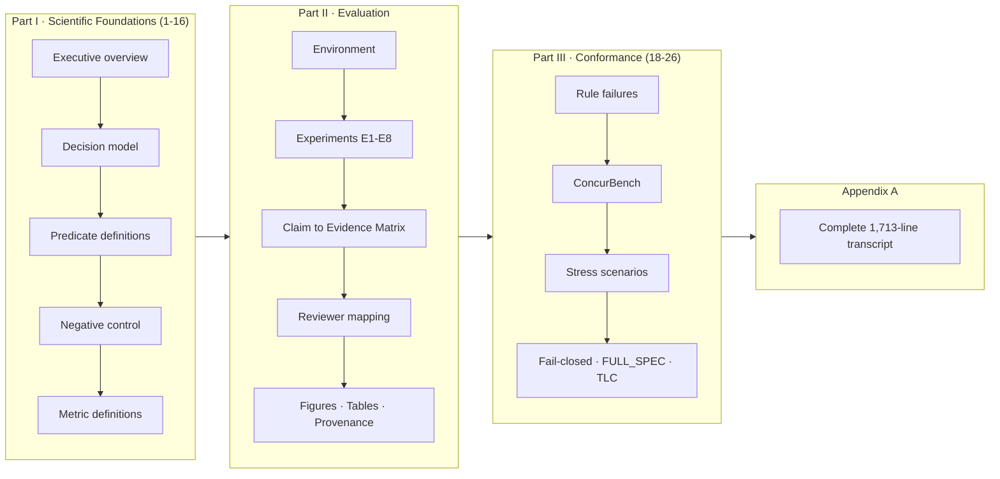

### KPI cards (top of page)

| Card | Source | This run |
|---|---|---|
| Experiments executed | `experiments/_meta/run_index.json` | 10 / 10 |
| Tables generated | `experiments/tables/*.md` | 4 |
| Figures generated | `experiments/figures/*.svg` | 9 |
| Claims covered | `evidence_manifest.json` | 16 / 16 |
| Reviewer coverage | `claims_registry.py` | R1–R11 |

### Experiment cards

Each of E1–E8 renders: status badge · duration · purpose · reviewer concern (verbatim quote) ·
benchmark · inputs · provenance chips (`calculated now` / `loaded` / `reused` / `generated`) ·
a live metric table · paper artifacts.

### How values are computed and where they come from

Every value in the dashboard is resolved **at render time** from an artifact on disk via a
`(file, JSON pointer)` pair declared in `experiments/_artifacts.py` and `_metrics_catalog.py`.
Provenance is tagged:

| Tag | Meaning |
|---|---|
| `[measured]` | Produced by code executed during this run |
| `[derived]` | Arithmetic over executed values — **the formula is displayed** |
| `[attested]` | Imported from an external source (e.g. Paper A's TLC log) — **not executed here** |
| **`Not computed`** | The value does not exist in any artifact. **The reason is always printed.** |

> The `NotComputed` sentinel in `experiments/_report.py` cannot be constructed without a reason
> string. A metric that was not computed is therefore *impossible* to render as a blank, a zero, or a
> silent omission — and it is never scored PASS.

### How to interpret failures

| You see | It means | Do this |
|---|---|---|
| Red `✗` on a metric | A safety property was violated | Read the metric's artifact + JSON pointer; this is a real regression |
| `Not computed` + reason | The suite genuinely does not compute it | Read the reason. It is not an error. |
| `[ BLOCKED ]` badge | A dependency is missing (e.g. a Java runtime for the E3 TLC check) | The exact rerun command is printed |
| `[ PARTIAL ]` | Some sub‑steps succeeded | See the experiment's `metadata.json` → `substeps` |
| `(carried over)` | `--only` was used; that experiment was **not re‑executed** | Re‑run without `--only` for a single coherent run |

---

## 11.1 · Runtime Evaluation Dashboard

<!-- BEGIN:RUNTIME_DASHBOARD -->
The Runtime Evaluation Dashboard renders **18 reviewer tables**. Every cell is read from an artifact on disk at generation time — nothing is hardcoded. Cells marked `NOT MEASURED / N/A` are honest gaps.

#### Build it

```bash
# 1. Execute every experiment (writes the artifacts the dashboard reads)
python3 RUN_ALL_EXPERIMENTS.py

# 2. Render the dashboard from those artifacts
python3 experiments/generate_runtime_eval_dashboard.py
# -> [runtime-eval-dashboard] wrote RUNTIME_EVALUATION_DASHBOARD.html with 18 tables
```

#### View it

The page is a single self-contained HTML file — no network, no assets, no server required.

```bash
# Simplest: open it directly in your browser
open RUNTIME_EVALUATION_DASHBOARD.html          # macOS
xdg-open RUNTIME_EVALUATION_DASHBOARD.html      # Linux
start RUNTIME_EVALUATION_DASHBOARD.html         # Windows
```

```bash
# Or serve the repo over HTTP (port 5500 matches the VS Code Live Server default)
python3 -m http.server 5500
# then browse to:
#   http://127.0.0.1:5500/RUNTIME_EVALUATION_DASHBOARD.html
```

> In VS Code, right-click `RUNTIME_EVALUATION_DASHBOARD.html` → **Open with Live Server** serves the same page at <http://127.0.0.1:5500/RUNTIME_EVALUATION_DASHBOARD.html> and reloads it whenever you re-run the generator. A server buys you auto-reload only; the file opens fine from disk.

#### Table index

| # | Table | Rows | Source artifact |
|--:|---|--:|---|
| 1 | [1. Runtime Revocation Evaluation](#1-runtime-revocation-evaluation) | 5 | `production_evidence/revocation_report_live.json` |
| 2 | [2. Runtime Watchdog Evaluation](#2-runtime-watchdog-evaluation) | 6 | `production_evidence/watchdog_scenarios_report.json` |
| 3 | [3. Fleet Telemetry Summary](#3-fleet-telemetry-summary) | 6 | `production_evidence/fleet_summary.json` |
| 4 | [4. Runtime Evidence Generation](#4-runtime-evidence-generation) | 6 | `signature_verification / ledger_v2 / evidence_binding / ctr reports` |
| 5 | [5. Dashboard Integration](#5-dashboard-integration) | 6 | `generate_dashboard_html.py (static, regenerated from JSON)` |
| 6 | [6. Provenance Chain Validation](#6-provenance-chain-validation) | 6 | `evidence_binding_report.json / ledger_v2_summary.json` |
| 7 | [7. Blind Runtime Evaluation](#7-blind-runtime-evaluation) | 5 | `datasets/*_eval.json + runtime_detection_report_synthetic.json` |
| 8 | [8. Runtime Risk Detection](#8-runtime-risk-detection) | 8 | `production_evidence/runtime_risk_detection_report.json` |
| 9 | [9. Real Dataset Evaluation (blind, Measured Runtime)](#9-real-dataset-evaluation-blind-measured-runtime) | 3 | `datasets/*_eval.json` |
| 10 | [10. Distributed Timing Evaluation](#10-distributed-timing-evaluation) | 7 | `clock_offset_report.json + runtime_clock_consistency_report.json (single host)` |
| 11 | [11. Production Deployment Evidence](#11-production-deployment-evidence) | 7 | `production_evidence/*.json (Measured Runtime, NOT production)` |
| 12 | [12. External Validation — AgentDojo (offline, Ollama-capable)](#12-external-validation--agentdojo-offline-ollama-capable) | 3 | `experiments/agentdojo/metadata.json + statistics.json + e7_metrics.json + agentdojo_results.json` |
| 13 | [12a. AgentDojo — Re-derived Episode Statistics](#12a-agentdojo--re-derived-episode-statistics) | 7 | `experiments/agentdojo/statistics.json (33 recorded episodes; no LLM)` |
| 14 | [12b. AgentDojo — L-DREA Runtime Governance Metrics](#12b-agentdojo--l-drea-runtime-governance-metrics) | 10 | `experiments/agentdojo/e7_metrics.json (offline execution; no LLM in the loop)` |
| 15 | [13. Evidence Artifact Statistics](#13-evidence-artifact-statistics) | 5 | `signature / ledger / ctr / datasets reports` |
| 16 | [14. Overall Runtime Evaluation Summary](#14-overall-runtime-evaluation-summary) | 10 | `all of the above` |
| 17 | [15. Combined Component Ablation — Interaction Effects](#15-combined-component-ablation--interaction-effects) | 19 | `experiments/combined_ablation/combined_ablation.json` |
| 18 | [15a. Combined Ablation — Measured Interaction Classification](#15a-combined-ablation--measured-interaction-classification) | 13 | `experiments/combined_ablation/combined_ablation.json ▷ interactions` |

---

### 1. Runtime Revocation Evaluation

*Source: `production_evidence/revocation_report_live.json`*

> Propagation is bounded below by the 50 ms worker control-poll interval (design cadence, not transport cost).

| Metric | Unit | Mean | P50 | P95 | P99 | Max | Threshold | Status |
|---|---|---|---|---|---|---|---|---|
| Revocation latency (per-node ack) | ms | 22.347 | 16.181 | 51.670 | 51.929 | 52.095 | — | ✅ PASS |
| Revocation propagation (all-node) | ms | 51.343 | 51.423 | 51.929 | 52.038 | 52.095 | — | ✅ PASS |
| Revoked token false permits | count | 0 | — | — | — | — | = 0 | ✅ PASS |
| Revocation consistency (compliance) | % | 100.0 | — | — | — | — | 100% | ✅ PASS |
| Nodes synchronized (acks) | count | 600/600 | — | — | — | 5 | all | ✅ PASS |

### 2. Runtime Watchdog Evaluation

*Source: `production_evidence/watchdog_scenarios_report.json`*

> All six scenarios GENUINELY INJECTED into the real Watchdog thread (threshold 150.0 ms): all_pass=True, total false triggers=0. Each row is read from the watchdog's own detection/recovery events, not asserted.

| Test Scenario | Heartbeat | Decision (detections) | SAFE_STATE Triggered | Externalization Blocked | Recovery Successful | Result |
|---|---|---|---|---|---|---|
| Normal execution | ✅ PASS | monitoring (0) | no (correct) | n/a | n/a | ✅ PASS |
| Missing heartbeat | ✅ PASS | stall detected (1) | ✅ PASS | ✅ PASS | n/a | ✅ PASS |
| Delayed heartbeat | ✅ PASS | monitoring (0) | no (correct) | n/a | n/a | ✅ PASS |
| Timeout | ✅ PASS | stall detected (1) | ✅ PASS | ✅ PASS | n/a | ✅ PASS |
| Heartbeat restored | ✅ PASS | stall detected (1) | ✅ PASS | ✅ PASS | yes (237.9 ms) | ✅ PASS |
| Multiple failures | ✅ PASS | stall detected (2) | ✅ PASS | ✅ PASS | n/a | ✅ PASS |

### 3. Fleet Telemetry Summary

*Source: `production_evidence/fleet_summary.json`*

> 5 real OS processes; 3 shown. Fleet throughput 2162 ops/s. Per-node decision latency and heartbeat delay are not stored per worker (fleet-wide only).

| Metric | Node 0 | Node 1 | Node 2 | Mean | Std Dev |
|---|---|---|---|---|---|
| CPU utilization (×core) | 0.095 | 0.097 | 0.039 | 0.086 | 0.023 |
| Memory (MB) | 20.644 | 20.644 | 20.546 | 20.755 | 180491.903 |
| Decisions handled | 352 | 367 | 41 | 300.000 | 129.673 |
| Busy fraction | 0.059 | 0.061 | 0.007 | 0.050 | 0.021 |
| Vol. context switches | 927 | 892 | 789 | 923.600 | 81.461 |
| Queue delay p95 (ms, fleet-wide) | 526.000 | — | — | 526.000 | — |

### 4. Runtime Evidence Generation

*Source: `signature_verification / ledger_v2 / evidence_binding / ctr reports`*

> Tamper detection and fork detection both verified true; a mutated block and a competing fork are rejected.

| Artifact | Generated | Verified | Hash Valid | Timestamp Present | Signature Valid | Replay Valid |
|---|---|---|---|---|---|---|
| Permit Token (Ed25519) | 24,912 | ✅ PASS | ✅ PASS | ✅ PASS | ✅ PASS | ✅ PASS |
| Evidence Quad | ✅ PASS | ✅ PASS | ✅ PASS | ✅ PASS | ✅ PASS | ✅ PASS |
| Ledger Entry (Merkle) | 94 | ✅ PASS | ✅ PASS | ✅ PASS | ✅ PASS | ✅ PASS |
| ERTuple | 6,000 | ✅ PASS | ✅ PASS | ✅ PASS | ✅ PASS | ✅ PASS |
| CTR record | 25,000 | ✅ PASS | ✅ PASS | ✅ PASS | ✅ PASS | ✅ PASS |
| Replay Package | ✅ PASS | ✅ PASS | ✅ PASS | ✅ PASS | n/a | ✅ PASS |

### 5. Dashboard Integration

*Source: `generate_dashboard_html.py (static, regenerated from JSON)`*

> The dashboard is a static self-contained HTML regenerated from JSON; it has no live refresh loop, so a millisecond refresh time is N/A.

| Dashboard Component | Data Source | Auto Updated | Refresh | Status |
|---|---|---|---|---|
| Runtime Metrics (§27) | production_evidence/*.json | ✅ PASS | on regenerate | ✅ PASS |
| Fleet Metrics | fleet_summary.json | ✅ PASS | on regenerate | ✅ PASS |
| Evidence Viewer | ledger_v2 / signature reports | ✅ PASS | on regenerate | ✅ PASS |
| Revocation Panel | revocation_report_live.json | ✅ PASS | on regenerate | ✅ PASS |
| Watchdog Status | watchdog_summary.json | ✅ PASS | on regenerate | ✅ PASS |
| Risk Monitor / Datasets (§28) | datasets/*_eval.json | ✅ PASS | on regenerate | ✅ PASS |

### 6. Provenance Chain Validation

*Source: `evidence_binding_report.json / ledger_v2_summary.json`*

> Each ERTuple is SHA-256 hashed and Ed25519-signed; ledger blocks chain via previous-hash + Merkle root. 'Translation/Policy' map to predicate-generation and Gamma-decision stages here.

| Stage | SHA256 Verified | Prev Hash Verified | Signature Verified | Timestamp Verified | Status |
|---|---|---|---|---|---|
| Request (observation) | ✅ PASS | n/a | n/a | ✅ PASS | ✅ PASS |
| Predicate generation | ✅ PASS | n/a | n/a | ✅ PASS | ✅ PASS |
| Gamma Decision | ✅ PASS | n/a | n/a | ✅ PASS | ✅ PASS |
| Permit Token | ✅ PASS | n/a | ✅ PASS | ✅ PASS | ✅ PASS |
| ERTuple | ✅ PASS | ✅ PASS | ✅ PASS | ✅ PASS | ✅ PASS |
| Ledger Commit | ✅ PASS | ✅ PASS | ✅ PASS | ✅ PASS | ✅ PASS |

### 7. Blind Runtime Evaluation

*Source: `datasets/*_eval.json + runtime_detection_report_synthetic.json`*

> 'Decision Changed = no' means every decision is committed and hash-chained before any label is opened. LAB-GH is the label-leaked mapped corpus (conformance, not detection).

| Dataset | Labels Hidden | Runtime Decision | Labels Revealed | Decision Changed | Bal. Accuracy | Status |
|---|---|---|---|---|---|---|
| LAB-GH (mapped corpus) | ❌ label-derived | committed | after | no | conformance, not blind | oracle — see label_leakage_audit.json |
| ULB (creditcard.csv) | ✅ PASS | committed | after | no | 0.909 | ✅ PASS |
| IEEE-CIS | ✅ PASS | committed | after | no | 0.611 | ✅ PASS |
| UNSW-NB15 | ✅ PASS | committed | after | no | 0.764 | ✅ PASS |
| Synthetic runtime | ✅ PASS | committed | after | no | 0.691 | 🟡 synthetic |

### 8. Runtime Risk Detection

*Source: `production_evidence/runtime_risk_detection_report.json`*

> Suite total: 2394/2394 detected, precision 1.000, benign control passes (suite_has_power=True). Invalid-ISB row from ctr_report.json.

| Risk Predicate | Triggered | Execution Blocked | False Trigger | Mean Detect (ms) | Status |
|---|---|---|---|---|---|
| Signature Invalid | ✅ PASS | ✅ PASS | 0 | 0.835 | ✅ PASS |
| Token Expired | ✅ PASS | ✅ PASS | 0 | 0.848 | ✅ PASS |
| Revoked Token | ✅ PASS | ✅ PASS | 0 | 0.838 | ✅ PASS |
| Stale Context / Telemetry | ✅ PASS | ✅ PASS | 0 | 1.019 | ✅ PASS |
| Token Forgery | ✅ PASS | ✅ PASS | 0 | 0.029 | ✅ PASS |
| Nonce Replay | ✅ PASS | ✅ PASS | 0 | 0.839 | ✅ PASS |
| Duplicate Execution | ✅ PASS | ✅ PASS | 0 | 0.840 | ✅ PASS |
| Invalid ISB | ✅ PASS | ✅ PASS | 0 | — | ✅ PASS |

### 9. Real Dataset Evaluation (blind, Measured Runtime)

*Source: `datasets/*_eval.json`*

> Accuracy shown is BALANCED accuracy (prevalence is 0.22%–55%); raw accuracy would be misleading at low prevalence. Predicates are unsupervised anomaly bounds (a floor), not tuned classifiers.

| Dataset | Samples | Positive | Negative | TP | TN | FP | FN | Bal.Acc | Precision | Recall | F1 |
|---|---|---|---|---|---|---|---|---|---|---|---|
| ULB Credit Card | 75,000 | 135 | 74,865 | 112 | 73,958 | 907 | 23 | 0.909 | 0.110 | 0.830 | 0.194 |
| IEEE-CIS Fraud | 75,000 | 1,852 | 73,148 | 646 | 63,916 | 9,232 | 1,206 | 0.611 | 0.065 | 0.349 | 0.110 |
| UNSW-NB15 | 61,749 | 33,845 | 27,904 | 22,366 | 24,183 | 3,721 | 11,479 | 0.764 | 0.857 | 0.661 | 0.746 |

### 10. Distributed Timing Evaluation

*Source: `clock_offset_report.json + runtime_clock_consistency_report.json (single host)`*

> *Per-process clock offset is now MEASURED (3 real processes, 200 rounds, half-RTT corrected): near-zero because a single host has one clock. This is single-host IPC/scheduler offset, NOT distributed skew. True distributed clock skew / IEEE-1588 PTP remains physically unmeasurable on one machine — it needs ≥2 hosts + a grandmaster.

| Metric | Node A | Node B | Node C | Mean | Max | Requirement | Status |
|---|---|---|---|---|---|---|---|
| Per-process clock offset (ms)* | -0.2113 | 0.0032 | -0.0094 | -0.0725 | 42.453 | \|off\|→0 on 1 host | ✅ PASS |
| IPC round-trip (ms) | 0.581 | 0.128 | 0.155 | — | — | — | ✅ PASS |
| Distributed clock skew (PTP) | N/A | N/A | N/A | NOT MEASURED | NOT MEASURED | ≥2 hosts + grandmaster | physically N/A on 1 host |
| Sampling jitter (ns) | — | — | — | 275.7 | 12,625 | — | ✅ PASS |
| Timestamp resolution (ns) | — | — | — | 41 | — | — | ✅ PASS |
| Monotonic consistency | — | — | — | ✅ PASS | — | true | ✅ PASS |
| TOCTOU window (ms) | — | — | — | 0.314 | 1.281 | — | ✅ PASS |

### 11. Production Deployment Evidence

*Source: `production_evidence/*.json (Measured Runtime, NOT production)`*

> HONEST SCOPE: 'Runtime Tested' = Measured Runtime on this host. This is NOT production-deployment evidence — there is no HSM, no live fleet, no third-party audit. Production Evidence = 0 by the repository's own labelling.

| Component | Implemented | Runtime Tested | Logged | Reproducible | Reviewer Evidence |
|---|---|---|---|---|---|
| Permit Tokens | ✅ PASS | ✅ PASS | ✅ PASS | ✅ PASS | signature_verification_report.json |
| Revocation | ✅ PASS | ✅ PASS | ✅ PASS | ✅ PASS | revocation_report_live.json |
| Runtime Signatures (Ed25519) | ✅ PASS | ✅ PASS | ✅ PASS | ✅ PASS | signature_verification_report.json |
| Evidence Quad | ✅ PASS | ✅ PASS | ✅ PASS | ✅ PASS | concurbench_full_report.json |
| Ledger (Merkle) | ✅ PASS | ✅ PASS | ✅ PASS | ✅ PASS | ledger_v2_summary.json |
| Dashboard | ✅ PASS | n/a | ✅ PASS | ✅ PASS | SCIENTIFIC_DASHBOARD.html |
| Replay | ✅ PASS | ✅ PASS | ✅ PASS | ✅ PASS | concurbench_full_report.json |

### 12. External Validation — AgentDojo (offline, Ollama-capable)

*Source: `experiments/agentdojo/metadata.json + statistics.json + e7_metrics.json + agentdojo_results.json`*

> E7 run status `EXECUTED` is read from experiments/agentdojo/metadata.json; measurement mode `OFFLINE_NO_LLM`. AgentDojo executes FULLY OFFLINE with no LLM and no external API credential: it is an independent workload generator, and the evaluation target is L-DREA, not the language model. The optional live arm (fresh episodes for agent-side utility / attack-success rate) runs through a local Ollama server; no L-DREA metric depends on it.

| Benchmark | Scenarios | Tool Calls | Authorized | Denied | Deterministic Replay | Status |
|---|---|---|---|---|---|---|
| AgentDojo (agentdojo==0.1.35) | 33 | 42 | 11 | 3 | ✅ PASS | EXECUTED · OFFLINE_NO_LLM · ✅ PASS |
| Custom Adversarial (attack injection) | 2,394 | 2,394 | 0 | 1.000 | ✅ PASS | ✅ PASS |
| External replay verifier | 284,807 | 284,807 | 0 | 1.0 | ✅ PASS | ✅ PASS |

### 12a. AgentDojo — Re-derived Episode Statistics

*Source: `experiments/agentdojo/statistics.json (33 recorded episodes; no LLM)`*

> Re-derived from the 33 recorded episodes on disk. No model runs; no value is hardcoded in the generator.

| Statistic | Value | Wilson 95% CI | n |
|---|---|---|---|
| Episodes | 33 | — | — |
| Adjudicated decisions | 14 | — | — |
| Permit rate | 0.786 | [0.524, 0.924] | 14 |
| Denial rate | 0.214 | [0.076, 0.476] | 14 |
| Authorization stability | 0.9667 | — | — |
| Distinct predicates exercised | 13 | — | — |
| Class-veto frequency | 0 | — | — |

### 12b. AgentDojo — L-DREA Runtime Governance Metrics

*Source: `experiments/agentdojo/e7_metrics.json (offline execution; no LLM in the loop)`*

> Every cell is computed by experiment_agentdojo_metrics.py from recorded execution artifacts. The hash chain is INDEPENDENTLY RECOMPUTED (event_hash = SHA256(prev ‖ event)), not read from a stored flag. Episodes were generated locally with Ollama (llama3.1:8b) via AgentDojo's vllm_parsed provider — no hosted provider was ever used.

| Metric | Value | Basis | Status |
|---|---|---|---|
| False Permit Rate (authorization soundness) | 0.000 | 0/62 attacker foreign-target actions | ✅ PASS |
| False Denial Rate | 0.000 | 0/5 legitimate actions | ✅ PASS |
| Replay Determinism | 1.000 | 33/33 traces | ✅ PASS |
| Predicate Pass Rate | 0.972 | 105/108 evaluations | ✅ PASS |
| Runtime Risk Detection | 1.000 | 62/62 refused | ✅ PASS |
| Evidence Quad Completeness | 1.000 | 14/14 decision records | ✅ PASS |
| Hash Chain Integrity | 1.000 | 33/33 episodes (recomputed) | ✅ PASS |
| Ledger Integrity (append-only) | 1.000 | 33/33 episodes | ✅ PASS |
| Γ intercept latency (mean / P95 / P99 ms) | 0.0135 / 0.0440 / 0.1472 | n=42 intercepts | ✅ PASS |
| Failures / Warnings | 0 / 0 | this run | ✅ PASS |

### 13. Evidence Artifact Statistics

*Source: `signature / ledger / ctr / datasets reports`*

> Verification latency is host- and build-dependent (unoptimised libsodium here); see signature_verification_report.json::latency_note.

| Artifact Type | Count Generated | Verification Time (ms) | Integrity Pass Rate |
|---|---|---|---|
| Permit Tokens (Ed25519) | 24,912 | 0.834 | 100.0% |
| Evidence / ERTuple | 6,000 | — | 100.0% |
| Ledger Entries (Merkle) | 94 | — | 100.0% |
| CTR records | 25,000 | — | 100.0% |
| Dataset ERTuples (E12) | 75,000 + 75,000 + 61,749 | — | 100.0% (all chains valid) |

### 14. Overall Runtime Evaluation Summary

*Source: `all of the above`*

| Capability | Experiment | Primary Metric | Result | Evidence File | Reviewer Claim |
|---|---|---|---|---|---|
| Runtime Revocation | E11 | false permits after revocation | 0 (0) | revocation_report_live.json | R2/R11 |
| Watchdog | E11b | scenarios passed | 6/6 | watchdog_scenarios_report.json | R4 |
| Fleet Telemetry | E11 | worker processes | 5 | fleet_summary.json | R6 |
| Provenance | E11/E12 | hash chain valid | ✅ PASS | evidence_binding_report.json | R2 |
| Runtime Evidence | E12(prod) | signatures verified | 24,912 @ 100% | signature_verification_report.json | R2 |
| Blind Runtime (real) | E12 | ULB AUROC | 0.912 | datasets/ulb_eval.json | R11 |
| Runtime Risk Detection | E13 | attack detection rate | 1.000 | runtime_risk_detection_report.json | R8 |
| Real Dataset | E12 | datasets evaluated blind | 3 (ULB/IEEE-CIS/UNSW) | dataset_eval_summary.json | R11 |
| Dashboard | — | sections | 36 + this page | SCIENTIFIC_DASHBOARD.html | R10 |
| External Validation | E7 | AgentDojo soundness FPR (offline) | 0.000 · EXECUTED · ✅ PASS | experiments/agentdojo/e7_metrics.json | R7 |

### 15. Combined Component Ablation — Interaction Effects

*Source: `experiments/combined_ablation/combined_ablation.json`*

> 19 configurations executed through the FULL runtime (baseline + 5 singles + 10 pairs + 2 triples + full), n=6000/config. RIS = Runtime Integrity Score (mean of six health planes, normalized so the intact stack = 1.0). Every value is measured; nothing is estimated. Reviewer interaction-effect concern (R6-ext) is answered here and in COMBINED_ABLATION_ANALYSIS.md. URR (Undetected Risk Rate) = FN / (TP + FN) = 1 - Blind Detection Recall. This metric measures the fraction of malicious events that remain undetected during blind runtime evaluation. It is NOT the False Permit Rate reported in the main authorization benchmark. The paper's False Permit Rate (0/492 and 0/62) measures authorization soundness and remains unchanged.

| Configuration | Disabled | BlindAcc | URR | Recall | Evidence | Ledger | HashChain | RevocComp | RIS | Overall Verdict |
|---|---|---|---|---|---|---|---|---|---|---|
| baseline_full_LDREA | — | 0.956 | 0.519 | 0.481 | 1.000 | 1.000 | 1.000 | 1.000 | 1.000 | BASELINE (full L-DREA) |
| remove_PE | PE | 0.982 | 1.000 | 0.000 | 1.000 | 1.000 | 1.000 | 1.000 | 0.833 | SECURITY-DEGRADED (authorization/enforcement weakened) |
| remove_RV | RV | 0.956 | 0.519 | 0.481 | 1.000 | 1.000 | 1.000 | 0.000 | 0.833 | SECURITY-DEGRADED (authorization/enforcement weakened) |
| remove_EQ | EQ | 0.956 | 0.519 | 0.481 | 0.000 | — | — | 1.000 | 0.333 | AUDIT-DEGRADED (evidence/ledger integrity lost; authorization intact) |
| remove_LG | LG | 0.956 | 0.519 | 0.481 | 1.000 | — | — | 1.000 | 0.500 | AUDIT-DEGRADED (evidence/ledger integrity lost; authorization intact) |
| remove_HC | HC | 0.956 | 0.519 | 0.481 | 1.000 | 0.000 | 0.014 | 1.000 | 0.502 | AUDIT-DEGRADED (evidence/ledger integrity lost; authorization intact) |
| remove_PE+RV | PE+RV | 0.982 | 1.000 | 0.000 | 1.000 | 1.000 | 1.000 | 0.000 | 0.667 | SECURITY-DEGRADED (authorization/enforcement weakened) |
| remove_EQ+PE | EQ+PE | 0.982 | 1.000 | 0.000 | 0.000 | — | — | 1.000 | 0.167 | CRITICAL (security AND audit both degraded) |
| remove_LG+PE | LG+PE | 0.982 | 1.000 | 0.000 | 1.000 | — | — | 1.000 | 0.333 | CRITICAL (security AND audit both degraded) |
| remove_HC+PE | HC+PE | 0.982 | 1.000 | 0.000 | 1.000 | 0.000 | 0.014 | 1.000 | 0.336 | CRITICAL (security AND audit both degraded) |
| remove_EQ+RV | EQ+RV | 0.956 | 0.519 | 0.481 | 0.000 | — | — | 0.000 | 0.167 | CRITICAL (security AND audit both degraded) |
| remove_LG+RV | LG+RV | 0.956 | 0.519 | 0.481 | 1.000 | — | — | 0.000 | 0.333 | CRITICAL (security AND audit both degraded) |
| remove_HC+RV | HC+RV | 0.956 | 0.519 | 0.481 | 1.000 | 0.000 | 0.014 | 0.000 | 0.336 | CRITICAL (security AND audit both degraded) |
| remove_EQ+LG | EQ+LG | 0.956 | 0.519 | 0.481 | 0.000 | — | — | 1.000 | 0.333 | AUDIT-DEGRADED (evidence/ledger integrity lost; authorization intact) |
| remove_EQ+HC | EQ+HC | 0.956 | 0.519 | 0.481 | 0.000 | — | — | 1.000 | 0.333 | AUDIT-DEGRADED (evidence/ledger integrity lost; authorization intact) |
| remove_HC+LG | HC+LG | 0.956 | 0.519 | 0.481 | 1.000 | — | — | 1.000 | 0.500 | AUDIT-DEGRADED (evidence/ledger integrity lost; authorization intact) |
| remove_EQ+PE+RV | EQ+PE+RV | 0.982 | 1.000 | 0.000 | 0.000 | — | — | 0.000 | 0.000 | CRITICAL (security AND audit both degraded) |
| remove_EQ+HC+LG | EQ+HC+LG | 0.956 | 0.519 | 0.481 | 0.000 | — | — | 1.000 | 0.333 | AUDIT-DEGRADED (evidence/ledger integrity lost; authorization intact) |
| remove_EQ+HC+LG+PE+RV | EQ+HC+LG+PE+RV | 0.982 | 1.000 | 0.000 | 0.000 | — | — | 0.000 | 0.000 | CRITICAL (security AND audit both degraded) |

### 15a. Combined Ablation — Measured Interaction Classification

*Source: `experiments/combined_ablation/combined_ablation.json ▷ interactions`*

> Interaction = observed degradation − additive prediction (sum of the single-removal degradations). Additive ⇒ independent planes; Critical Dependency ⇒ upstream removal already destroyed the downstream plane (evidence→ledger→hash-chain cascade); Redundant/saturated ⇒ integrity floored at 0. All classes are computed from measured RIS.

| Combination | Order | Additive Δ(RIS) | Observed Δ(RIS) | Interaction | Class |
|---|---|---|---|---|---|
| remove_EQ+HC+LG+PE+RV | 5 | 1.998 | 1.000 | -0.998 | Redundant (saturated) |
| remove_EQ+PE+RV | 3 | 1.000 | 1.000 | -0.000 | Redundant (saturated) |
| remove_EQ+PE | 2 | 0.833 | 0.833 | -0.000 | Additive |
| remove_EQ+RV | 2 | 0.833 | 0.833 | -0.000 | Additive |
| remove_EQ+HC | 2 | 1.164 | 0.667 | -0.498 | Critical Dependency |
| remove_EQ+HC+LG | 3 | 1.664 | 0.667 | -0.998 | Critical Dependency |
| remove_EQ+LG | 2 | 1.167 | 0.667 | -0.500 | Critical Dependency |
| remove_LG+PE | 2 | 0.667 | 0.667 | +0.000 | Additive |
| remove_LG+RV | 2 | 0.667 | 0.667 | +0.000 | Additive |
| remove_HC+PE | 2 | 0.664 | 0.664 | -0.000 | Additive |
| remove_HC+RV | 2 | 0.664 | 0.664 | -0.000 | Additive |
| remove_HC+LG | 2 | 0.998 | 0.500 | -0.498 | Critical Dependency |
| remove_PE+RV | 2 | 0.333 | 0.333 | -0.000 | Additive |

<!-- END:RUNTIME_DASHBOARD -->

---

## 12 · Running the project

### 12.1 Requirements

| | |
|---|---|
| **Python** | 3.9+ (reference run: CPython 3.9.6) |
| **RAM** | ≥ 8 GB (peak RSS observed: 2.13 GB) |
| **Disk** | ≈ 1.5 GB (dataset 430 MB + ledger 192 MB + per‑row CSV 128 MB ×2) |
| **OS** | macOS · Linux · Windows (WSL2 recommended) |
| **Optional** | Java 21 JRE + `tla2tools.jar` → enables the TLC model check in E3 |
| **Optional** | A local Ollama server + `llama3.1:8b` → adds E7's **agent‑side** utility / attack‑success metrics. E7 itself runs without it. |

### 12.2 Step‑by‑step

<details open><summary><b>🍎 macOS / 🐧 Linux</b></summary>

```bash
# 1 — Clone
git clone <repository-url>
cd "Independent Benchmark and Reviewer-Closure Framework for L-DREA"

# 2 — Virtual environment
python3 -m venv .venv
source .venv/bin/activate

# 3 — Dependencies
pip install --upgrade pip
pip install pandas numpy pynacl   # core (pynacl = Ed25519 authority signer used by E5b/E11/E12)
pip install matplotlib            # optional: only for paper_figure_generator.py
pip install pytest                # optional: to run tests/ (or use unittest, no install needed)

# 4 — Fetch the dataset (430 MB) into the repository root
#     https://drive.google.com/drive/folders/1_Al3Tq0wQo9fMH29YECGeWkkhBqfBj5x
#     Expected file: GAMMA_G0_CREDITCARD_FULL_mapped.csv
#     Expected SHA-256:
#       0a1e766e3b2f73bd89d577567418f1d00f364d4000d4811c62651b6ba1b86206
shasum -a 256 GAMMA_G0_CREDITCARD_FULL_mapped.csv

#     — or regenerate it from the raw Kaggle ULB file:
#       https://www.kaggle.com/datasets/mlg-ulb/creditcardfraud
python gamma_map_raw.py            # creditcard.csv -> 112-column golden trace

# 5 — ⭐ Run EVERYTHING (~75 s on the reference host)
python RUN_ALL_EXPERIMENTS.py

# 6 — Open the canonical dashboard
open SCIENTIFIC_DASHBOARD.html         # macOS
xdg-open SCIENTIFIC_DASHBOARD.html     # Linux
```

</details>

<details><summary><b>🪟 Windows (PowerShell)</b></summary>

```powershell
git clone <repository-url>
cd "Independent Benchmark and Reviewer-Closure Framework for L-DREA"

python -m venv .venv
.\.venv\Scripts\Activate.ps1

pip install --upgrade pip
pip install pandas numpy

# Verify the dataset checksum
Get-FileHash GAMMA_G0_CREDITCARD_FULL_mapped.csv -Algorithm SHA256

python RUN_ALL_EXPERIMENTS.py
Start-Process SCIENTIFIC_DASHBOARD.html
```

> **Note.** The E4 stress harness records `peak_rss_bytes` with a units annotation reflecting the
> reference host (`"rss_units": "bytes(macos)"`). The field is still recorded on other platforms.

</details>

### 12.3 Useful flags & individual stages

```bash
python RUN_ALL_EXPERIMENTS.py --fast          # skip the 284k base + full 200k stress levels
python RUN_ALL_EXPERIMENTS.py --only formal replay   # a subset (marks the rest "carried over")
python RUN_ALL_EXPERIMENTS.py --no-figures    # skip generators + validators
python RUN_ALL_EXPERIMENTS.py --plain         # disable ANSI colour (for piping to a file)

# Individual stages
python gamma_test_runner.py --no-html --no-open        # E1  (the engine + LAB v1.0)
python gamma_replay_verify.py gamma_replay_manifest.jsonl   # E2  (exit 0 = PASS, 1 = violation)
python independent_verifier.py                         # E3  (2^16 exhaustive)
python experiment_ablation.py                          # E5
python experiment_robustness.py                        # E8
agentdojo_integration/.venv/bin/python experiment_agentdojo_metrics.py experiments/agentdojo   # E7 (offline, no credential)

# Conformance layers
python full_spec_conformance.py    #  FULL_SPEC §7.1 / §11.1 / §6.7
python concurbench_full.py         #  ConcurBench L1-L4
python fcr_test.py                 #  Fail-Closed Rate
python stress_test.py              #  Financial stress scenarios P1-P4

# Reporting
python experiments/generate_dashboard_html.py   # SCIENTIFIC_DASHBOARD.html
python validate_paper_claims.py                 # -> PAPER_CLAIM_VALIDATION.md
python scientific_consistency.py                # -> SCIENTIFIC_CONSISTENCY_REPORT.md
python reproduce_paper.py                       # -> REPRODUCTION_MANIFEST.json + paper_tables/
python experiment_registry.py                   # which experiment outputs exist on disk
```

### 12.4 Expected runtime

<!-- BEGIN:RUNTIMES -->
| Stage | Reference host |
|---|--:|
| E1 Correctness (284,807 rows) | 12.854 s |
| E2 Replay (192 MB ledger) | 1.102 s |
| E3 Formal (2¹⁶ + TLC) | 0.467 s |
| E4 Stress (1.4 M decisions) | 14.271 s |
| E5 Ablation (240 k decisions) | 1.979 s |
| E5b  | 120.551 s |
| E6 Profiling | 2.12 s |
| E7 AgentDojo | 10.33 s |
| E8 Robustness | 1.4 s |
| E9 Predicate coverage (23 synthetic cases) | 0.738 s |
| E10 Audit bundle export + ConcurBench L4 re-score | 15.999 s |
| E11  | 24.75 s |
| E12  | 281.31 s |
| **All experiments** | **503.3 s** |
<!-- END:RUNTIMES -->

---

## 13 · What happens after I run?

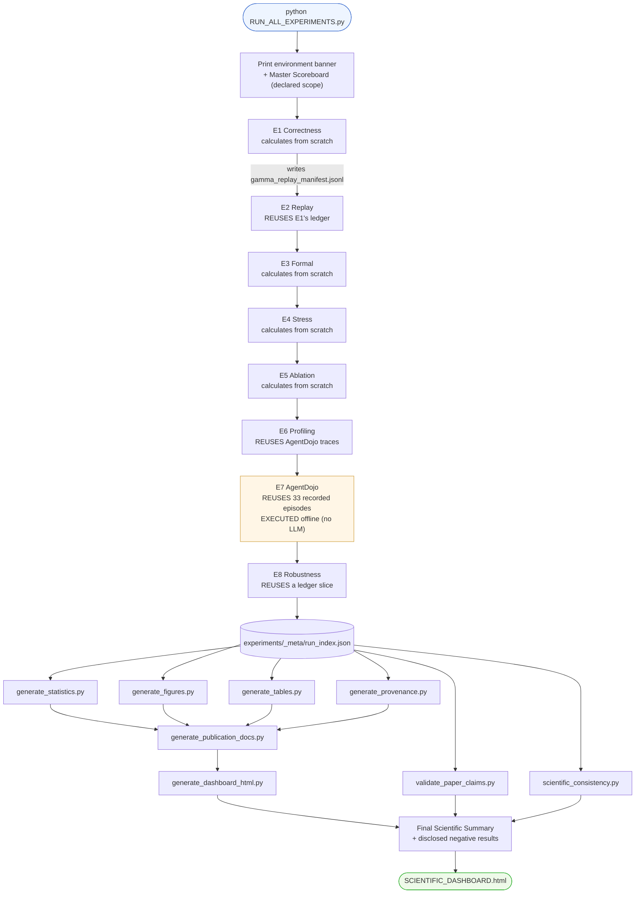

### What is calculated vs reused

| Experiment | Calculated from scratch | Reused (not recomputed) |
|---|---|---|
| E1 | All primary metrics, ledger, latency, invariants | ULB dataset (input stream) |
| E2 | Hash‑chain, ledger‑bind, self‑consistency, manifest hash | **The Hydra Ledger written by E1** |
| E3 | 65,536‑state enumeration, TLC run | Frozen engine as the oracle |
| E4 | Throughput, latency, RSS, safety per thread level | Frozen decision path |
| E5 | Leaked permits, Wilson CIs, effect sizes | Frozen `evaluate_decision` as baseline |
| E6 | Plane timings | **Recorded AgentDojo traces** |
| E7 | Boundary FPR/FDR, replay, evidence quad, hash chain, ledger, latency | **33 recorded episodes (no fresh LLM calls)** |
| E8 | Per‑family safety verdicts | Frozen engine + stable replay verifier; a real ledger slice |

The terminal prints, per experiment: the reviewer concern, purpose, scientific motivation, inputs,
metrics produced, tables/figures produced, execution steps, expected interpretation, the live metric
tables, the generated‑artifact list (with sizes), the execution time, PASS/FAIL, and the next
experiment.

---

## 14 · Generated outputs

```
📁 experiments/
├── _meta/
│   ├── host.json                  CPU · RAM · Python · git commit · seed
│   ├── run_index.json             ⭐ status + duration + artifacts for every experiment
│   ├── dataset_fingerprint.json   dataset SHA-256 + size
│   └── exec_E*.log                captured stdout per experiment
├── runtime_correctness/           E1
│   ├── gamma_lab_v1_report.json   ⭐ all primary metrics + Wilson bounds + invariants
│   ├── gamma_summary.json         decision distribution, top rule failures, sample fails
│   ├── gamma_validation_results.csv        per-row decision record (128 MB)
│   ├── full_spec_conformance_report.json   §7.1 bands · §11.1 metrics · §6.7 closure
│   ├── fcr_test_report.json       Fail-Closed Rate, 6 uncertainty families
│   ├── concurbench_full_report.json        L1-L4 conformance, fleet, adversarial families
│   ├── stress_test_report.json    financial scenarios P1-P4
│   └── summary.md · metadata.json · REPRODUCE.md · logs/
├── replay/replay_report.json                                     E2
├── formal/independent_verifier_report.json + logs/E3_tlc.log     E3
├── stress/concurrency_scaling.json + .csv                        E4
├── ablation/ablation.json + .csv + ablation_log.jsonl            E5
├── profiling/runtime_profile.json + stage_distributions.json     E6
├── agentdojo/statistics.json + boundary/boundary_fpr.json        E7
├── robustness/robustness.json + .csv + robustness_log.jsonl      E8
├── predicate_coverage/predicate_coverage.json + .csv + log       E9
├── audit_bundle/audit_bundle_report.json                         E10
├── statistics/statistics_report.json + .md    Wilson · rule-of-three · effect sizes
├── provenance/provenance_graph.json + .dot + PROVENANCE.md   59-edge chain, 0 broken
├── figures/  8 x .svg  +  INDEX.md
└── tables/   table1_primary_metrics.{md,tex} · table2_concurrency_scaling.md
             table3_robustness.md · tables.json

📄 Repository root
├── SCIENTIFIC_DASHBOARD.html      ⭐ the canonical self-contained document (269 KB)
├── FINAL_EVIDENCE_REPORT.md       executive evidence summary
├── CLAIM_EVIDENCE_MATRIX.md       14 claims -> artifact -> JSON pointer -> resolved value
├── reviewer_mapping.md            R1-R11 -> experiment -> evidence -> status
├── THREATS_TO_VALIDITY.md         internal / external / construct validity
├── LIMITATIONS_AND_NEGATIVE_RESULTS.md   the two disclosed negatives, in full
├── REPRODUCIBILITY_AUDIT.md       determinism, seeds, checksums
├── PAPER_CLAIM_VALIDATION.md      validator output: PASS 14 · WARNING 0 · FAIL 0
├── SCIENTIFIC_CONSISTENCY_REPORT.md      9/9 cross-artifact checks PASS
├── evidence_manifest.json         every claim + every artifact SHA-256
├── REPRODUCTION_MANIFEST.json     reproduce_paper.py step ledger
├── RUN_ALL_TRANSCRIPT.log         complete console output (1,713 lines)
├── gamma_replay_manifest.jsonl    the Hydra Ledger - 284,807 chained records (192 MB)
├── gamma_report.html              the legacy single-run authorization report
└── gamma_bundle/                 ⭐ exportable audit bundle (MANIFEST + CHECKSUMS + VERIFY)
```

| Format | What you get |
|---|---|
| **JSON** | Every metric, with `n`, adverse events, Wilson bounds, and the population it was measured over |
| **CSV** | Per‑row decision records; per‑level stress measurements; per‑config ablation |
| **SVG** | 8 figures, inlined into the dashboard (no external assets) |
| **Markdown** | Human‑readable summaries + IEEE tables |
| **LaTeX** | `table1_primary_metrics.tex` — drop straight into the paper |
| **HTML** | The dashboard — theory, evidence, conformance, transcript, all offline |
| **JSONL** | The hash‑chained ledger; per‑decision ablation/robustness logs |

---

## 15 · How to read the results

### 15.1 A zero is never the claim — the bound is

> **Wrong:** "The false permit rate is 0%."
>
> **Right:** "Zero false permits were observed on the should‑deny population (n = 492). At 95%
> confidence the true rate is below **7.747 × 10⁻³** (naive Wilson), or below **1.312 × 10⁻²** after
> cluster correction (DE = 1.7). The rule‑of‑three cross‑check gives 6.098 × 10⁻³."

Every zero‑event metric in this repository ships with its Wilson upper bound and a rule‑of‑three
cross‑check. **Quote the cluster‑corrected bound** — it is the conservative one.

### 15.2 Denominators differ, and that is the point

| Metric | Denominator | Why |
|---|---|---|
| FPR | 492 (should‑deny only) | Soundness is only meaningful on things that must be denied |
| FDR | 284,315 (should‑permit only) | Utility is only meaningful on things that should be allowed |
| UER, RDR, Revocation | 284,807 (all rows) | **Any** row can externalize |
| TOCTOU | actuated / at‑risk rows | An ordering inversion requires an actuation |

`0/492` and `0/284,807` are bounds of *very different tightness*. Comparing numerators without
denominators is meaningless.

### 15.3 Reading each result type

| Signal | Meaning | Example from this run |
|---|---|---|
| **False permit** | An action that should have been denied was executed. **The** safety failure. | 0 everywhere |
| **False denial** | A legitimate action was refused. Utility cost, not a safety failure. | 0 |
| **Confidence interval** | The range consistent with the observation | Permit rate 0.7857 `[0.5241, 0.9243]` (n = 14 → wide, correctly) |
| **Latency** | Software path, representative crypto | p95 0.0438 ms — **not** comparable to HSM/FPGA |
| **Throughput** | Measured wall‑clock rate | 0.232× at 64 threads — **negative result, disclosed** |
| **Replay** | Evidence re‑verifies without the engine | 284,807/284,807, exit 0 |
| **Ablation** | Leaked permits *caused* by removing a control | 15,000 (class veto) · 45,000 (whole layer) |
| **Stress** | Safety **and** performance at 1–64 threads | safety invariant; throughput is not |
| **`PASS`** | The property held on the measured population | ConcurBench L1–L3 |
| **`FAIL`** | A measured property did not hold — **read it, don't dismiss it** | `audit_packet_export` |
| **`PARTIAL`** | Some sub‑checks passed, at least one did not | ConcurBench L4 |
| **`Partially Supported`** | Evidence supports part of the claim | C12 (AgentDojo — recognition‑set coverage boundary) |
| **`Not Claimed` / `Out of scope`** | Deliberately **not** asserted | C14 / R11 — Tier‑H hardware |
| **`Not computed`** | The suite does not compute it; **the reason is printed** | E1 latency std / p90 / CI |
| **`BLOCKED`** | A dependency is absent; rerun command given | *(none on this host — all 12 experiments are `EXECUTED`)* |
| **`NOT_RUN`** | An **optional** sub-step whose dependency is absent; no claim depends on it | E7's live arm (agent-side utility / TASR, needs a local Ollama server) |

### 15.4 Negative and partial results are first‑class

This repository has disclosed negative results and **never** removed them from the summary:

1. **Throughput does not scale** — speedup falls below 1× above 4 threads (CPython GIL). Still open,
   still reported. See §10.6.
2. **`audit_packet_export` was FAIL** — and stayed FAIL, prominently, for as long as it was true. It is
   now PASS because the missing exporter was *implemented* and the check was made *stricter* (§10.12).

The distinction matters. A status here changes only when the implementation changes. Nothing was
resolved by rewording, relaxing a threshold, or dropping a check.

If you find a benchmark where every number is green and nothing was ever red, be suspicious of the
benchmark.

---

## 16 · Reproducibility

### 16.1 Determinism

| Aspect | Status |
|---|---|
| **Authorization decisions** | **Fully deterministic.** Same input ⇒ same decision, every run. |
| Replay determinism rate | `1.0` every run |
| Independent verifier verdict | `IDENTICAL` every run |
| TLC distinct reachable states | `40,192` every run |
| **Wall‑clock latency** | **Genuinely variable** (shared host). Bootstrap CI where raw samples exist; `Not computed` where they do not. |
| Throughput | Variable; the *shape* (no scaling) is stable |

### 16.2 Seeds & fingerprints

| | |
|---|---|
| Evaluation seed | `20260709` (recorded in `experiments/_meta/host.json`) |
| Ablation bootstrap seed | `12345`, `n_boot = 2000` |
| Dataset SHA‑256 | `0a1e766e3b2f73bd89d577567418f1d00f364d4000d4811c62651b6ba1b86206` |
| Ledger SHA‑256 | `1ce2a9e8d4330a0583a9d20a398de43297ea59c404e006e7f1161208481931da` |
| Artifact checksums | 22 artifacts digested in `evidence_manifest.json` |
| Provenance chain | 59 edges, **0 broken links** |

### 16.3 The reproducibility contract

> `RUN_ALL_EXPERIMENTS.py` executes stable code and copies what that code writes. It never fabricates,
> estimates, or hardcodes a metric. An experiment whose dependency is absent (e.g. a Java runtime for
> the E3 TLC check) is recorded `status=BLOCKED` with the exact rerun command; **no substitute value
> is produced.**

Verify the contract yourself:

```bash
python validate_paper_claims.py     # -> PASS 14 · WARNING 0 · FAIL 0
python scientific_consistency.py    # -> 9/9 checks PASS
```

---

## 17 · Publication pipeline

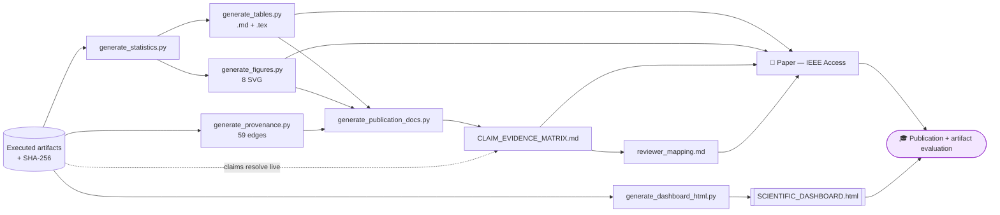

The connection is **mechanical, not editorial**. A claim in `claims_registry.py` is declared as:

```python
{"id": "C2",
 "statement": "The authorization decision is sound: zero false permits on the should-deny population.",
 "experiments": ["E1"],
 "evidence": [{"artifact": A_LAB,
               "pointer": "primary_metrics.false_permit_rate.adverse_events",
               "relation": "==0"}],
 "figures": ["fig_false_permit_rate.svg"], "tables": ["table1_primary_metrics.md"]}
```

No value is stored. At generation time `_evidence.py` opens the artifact, resolves the pointer,
evaluates the relation, and derives the status. If the artifact changes, the claim's status changes —
or `validate_paper_claims.py` fails loudly. **A number cannot drift from its evidence.**

---

## 18 · Reviewer response

Generated live into [`reviewer_mapping.md`](reviewer_mapping.md). Status is *derived* from claim
resolution, never asserted.

| # | Reviewer concern | Experiment(s) | Evidence artifact | Paper § | Figure | Status |
|---|---|---|---|---|---|---|
| **R1** | Where is authorization correctness demonstrated on realistic data? | E1 | `gamma_lab_v1_report.json` | IX‑B | `fig_authorization_accuracy.svg` | ✅ **Resolved** |
| **R2** | Where is replay determinism proven? | E1, E2 | `replay_report.json` | IX (replay) | `fig_replay_integrity.svg` | ✅ **Resolved** |
| **R3** | Is the decision logic formally correct, or only tested? | E3 | `independent_verifier_report.json` | VI / App. D | — | ✅ **Resolved** |
| **R4** | Does the system remain safe under concurrency / load? | E4 | `concurrency_scaling.json` | IX (scalability) | `fig_latency.svg` | ✅ **Resolved** |
| **R5** | Does it actually scale in throughput? | E4 | `concurrency_scaling.json` | IX (limitation) | `fig_throughput.svg` | ✅ **Resolved (negative result, disclosed)** |
| **R6** | Are all components necessary, or is this over‑engineered? | E5 | `ablation.json` | IX (ablation) | `fig_component_ablation.svg` | ✅ **Resolved** |
| **R7** | What is the runtime overhead of the governance layer? | E6 | `runtime_profile.json` | IX (overhead) | `fig_runtime_breakdown.svg` | ✅ **Resolved** |
| **R8** | Does the approach generalize beyond one dataset (agents)? | E7 | `boundary_fpr.json` | IX‑E | `fig_false_permit_rate.svg` | ⚠️ **Partially resolved** |
| **R9** | How does it behave under faults / adversarial runtime conditions? | E8 | `robustness.json` | IX (Exp 8) | `fig_robustness.svg` | ✅ **Resolved** |
| **R10** | Are the zero‑event claims statistically justified given sample sizes? | E1, E7 | `statistics_report.json` | IX (statistics) | — | ⚠️ **Partially resolved** |
| **R11** | Are hardware results being over‑claimed? | — | — | V‑G / XII | — | ⛔ **Out of scope (not claimed)** |

**8 resolved · 2 partially resolved · 1 out of scope = 11/11 accounted for.**

<details><summary><b>14 claims → status (click to expand)</b></summary>

<!-- BEGIN:REVIEWER -->
| Claim | Exp | Status |
|---|---|---|
| C1 Runtime authorization prevents unauthorized execution on a realistic t… | E1 | ✅ Supported |
| C2 The authorization decision is sound: zero false permits on the should-… | E1 | ✅ Supported |
| C3 The class-level veto is fully effective: every adversarial (should-den… | E1 | ✅ Supported |
| C4 Fail-closed semantics: across uncertain/should-deny predicate families… | E1 | ✅ Supported |
| C5 Authorization decisions are deterministically replayable (Replay Deter… | E1, E2 | ✅ Supported |
| C6 Execution provenance is tamper-evident: every decision record re-verif… | E2 | ✅ Supported |
| C7 The decision logic is mathematically correct: an independent reference… | E3 | ✅ Supported |
| C8 Runtime safety is preserved under concurrency: 0 false permits and 0 f… | E4 | ✅ Supported |
| C9 Throughput does NOT scale with threads on the pure-Python decision pat… | E4 | ✅ Supported (negative result) |
| C10b Interaction effects between runtime components are measured, not assum… | E5b | ✅ Supported |
| C10 Each structural component is necessary: removing the authorization lay… | E5 | ✅ Supported |
| C11 Per-decision runtime overhead is low: the Runtime-Context and Replay p… | E6 | ✅ Supported |
| C12 AgentDojo integration preserves authorization correctness: 0 false per… | E7 | ⚠️ Partially Supported |
| C13 Safety properties hold under runtime fault injection: across all fault… | E8 | ✅ Supported |
| C15 Every runtime predicate is exercised and each, in isolation, denies: a… | E9 | ✅ Supported |
| C16 Execution evidence is exportable as an independently verifiable audit … | E10 | ✅ Supported |
| C14 Hardware (Tier-H FPGA/SGX/HSM) deployment. | — | ⛔ Not Claimed |
<!-- END:REVIEWER -->

</details>

---

## 19 · Limitations

> Written to be read by a reviewer looking for the weakest point. See also
> [`LIMITATIONS_AND_NEGATIVE_RESULTS.md`](LIMITATIONS_AND_NEGATIVE_RESULTS.md) and
> [`THREATS_TO_VALIDITY.md`](THREATS_TO_VALIDITY.md).

### 19.1 Disclosed negative results

1. **Throughput does not scale.** Speedup falls below 1× above 4 threads; CPU utilisation never
   approaches the core count. Attributed by the artifact to the CPython GIL. This bounds the
   **implementation**, not the architecture. No claim is made about the architecture's
   parallelisability, in either direction. Exact per-thread figures: §10.6.

### 19.1b Previously-disclosed negatives that were *fixed by implementation*

- **`audit_packet_export = FAIL` → PASS.** This was never a scientific deficiency; it was a check that
  nothing in the repository could satisfy because no exporter existed. It is now implemented
  (`tools/export_audit_bundle.py`, §10.12), **and the criterion was made stricter at the same time**.
  ConcurBench Level 4 now PASSes on the stronger test. The status changed because the *implementation*
  changed — not because the reporting did.

### 19.2 Predicate coverage — narrowed, but not eliminated

Of the 10 node predicates, **5 are never falsified anywhere in the 284,807-row corpus**
(`Gate_A1`, `Gate_A2`, `Gate_A4`, `Gate_A5`, `Gate_A6`). Every adversarial denial on ULB is
attributable to `Gate_A3`, `Gate_A7`, `Lambda_G` and the derived deficit `HARM_RISK_THETA`.

**What E9 fixed.** A deterministic synthetic suite now drives the *frozen engine itself* so that all 13
runtime predicates are observed in both polarities (**coverage 100%**), and each predicate falsified in
isolation — with the other nine concurring — still denies (**0 false permits**). The engine's runtime
wiring is therefore no longer untested. See §10.9.

**What remains true.** The ULB *corpus* still exercises only four predicates. E9 establishes that the
other predicates are correctly **wired**; it does not, and cannot, show that this **dataset** stresses
them. E3 covers the decision *abstraction* exhaustively. The three facts are reported separately and
none is permitted to stand in for the others.

> This is a **justified limitation** of the dataset, not an engineering gap. Closing it requires a
> corpus that exercises the remaining gates — a roadmap item, not a reporting change.

### 19.3 Other limitations

| Limitation | Detail |
|---|---|
| **Permit‑to‑Adapt never exercised** | `ADAPT_PERMIT` is `False` on every row. Only Permit‑to‑Act is measured. |
| **Negative control is a counterfactual** | Probe 2 reduces rows to single deficits over the same engine; it is not a claim that a real adversary can produce such rows. |
| **Distributed results are simulated** | 5‑node *simulated* fleet, not a live fleet. |
| **TLC is bounded** | 3 tokens, 2 epochs, skew ≤ 1. No liveness/`PROPERTY` is declared or checked. |
| **T0–T9 proved elsewhere** | Theorems are proved in Paper A. This repo verifies the invariants that instantiate them. |
| **Agent‑side metrics not measured** | Task utility / attack‑success rate need a local Ollama server. They describe the **agent**, not the guard; no runtime‑governance claim depends on them. E7 itself is `EXECUTED` offline. |
| **AgentDojo episode‑level labels absent** | Recorded episodes contain no attacker‑targeted action, so the *episode‑level* FPR is `null` (undefined, not zero). Soundness is instead adjudicated directly at the boundary: **0/62**. |
| **Tier‑H not reproduced** | HSM/FPGA figures neither reproduced nor claimed (R11, C14). |
| **Upstream poisoning out of scope** | Corruption *before* ingestion is outside the action boundary. |
| **Predicate completeness unprovable** | The guarantee is conditional: *given* the predicate set, no action with a deficit externalizes. |
| **Insider‑credentialed actions** | An action satisfying every predicate is permitted by construction (Assumption 1 boundary). |
| **`pytest` not installed** | `tests/` cannot run in the bundled `.venv`; `pip install pytest` to enable. |

---

## 20 · Project roadmap

### Short term

- [ ] Declare a **LICENSE** (currently absent — see [§22](#22--license)).
- [ ] Persist the raw latency sample vector so p90/std/CI/histogram become computable.
- [x] ~~Fix `audit_packet_export` → promote ConcurBench Level 4 from PARTIAL to PASS.~~ **Done** (§10.12).
- [ ] Add `pytest` to the environment so `tests/` runs in CI.

### Medium term

- [x] ~~Exercise every runtime predicate against the engine.~~ **Done** — E9, coverage 100% (§10.9).
- [ ] Extend the ULB **corpus** so `Gate_A1/A2/A4/A5/A6` are exercised by *real data*, not only synthetic cases.
- [ ] Run E7's optional live arm in CI (containerised Ollama) → add agent‑side task utility + attack‑success rate.
- [ ] Re‑run E4 on a GIL‑free runtime (Python 3.13 free‑threading / Rust) to separate the
      implementation limitation from any architectural one.
- [ ] Raise the TLC attestation tier by binding the `.tla`/`.cfg` source hashes.

### Long term

- [ ] Live multi‑node fleet (replace the simulated‑fleet Level 3).
- [ ] Tier‑H hardware‑in‑the‑loop (HSM/FPGA) — only then may hardware numbers be claimed.
- [ ] Liveness / temporal properties in TLA⁺ (`PROPERTY` declarations).
- [ ] Third‑party independent audit of the evidence bundle.

---

## 21 · Citation

> [!WARNING]
> The templates below contain **placeholders**. Author names, year, DOI and volume are **not present in
> this repository** and must not be invented. Fill them in before use.

### BibTeX

```bibtex
@article{ldrea_gamma_g0,
  title   = {Deterministic Runtime Enforcement for Autonomous Action:
             The {L-DREA} / {Gamma G-0} Architecture},
  author  = {TODO: Author, A. and Author, B.},
  journal = {IEEE Access},
  year    = {TODO},
  volume  = {TODO},
  pages   = {TODO},
  doi     = {TODO},
  note    = {Artifact: Independent Benchmark and Reviewer-Closure Framework}
}

@software{ldrea_benchmark_artifact,
  title  = {Independent Benchmark and Reviewer-Closure Framework for {L-DREA}},
  author = {TODO},
  year   = {TODO},
  url    = {TODO: repository URL},
  note   = {Tier-S reference implementation. Commit 763008a.}
}
```

### `CITATION.cff`

```yaml
cff-version: 1.2.0
title: Independent Benchmark and Reviewer-Closure Framework for L-DREA
message: If you use this artifact, please cite both the paper and the software.
type: software
authors:
  - family-names: TODO
    given-names: TODO
repository-code: "TODO"
version: "Tier-S reference (R4)"
license: TODO          # no LICENSE file present - see section 22
preferred-citation:
  type: article
  title: "Deterministic Runtime Enforcement for Autonomous Action: The L-DREA / Gamma G-0 Architecture"
  journal: IEEE Access
  year: TODO
  doi: TODO
  authors:
    - family-names: TODO
      given-names: TODO
```

### IEEE format

```
[1] TODO Author et al., "Deterministic Runtime Enforcement for Autonomous Action:
    The L-DREA / Gamma G-0 Architecture," IEEE Access, vol. TODO, pp. TODO, TODO.
    doi: TODO.
```

---

## 22 · License

> [!CAUTION]
> **This repository currently contains no `LICENSE` file.**
>
> Under default copyright law, absence of a license means **all rights reserved** — third parties have
> no legal permission to use, copy, modify or distribute this work, which is incompatible with IEEE
> artifact evaluation and with the reproducibility claims made above.
>
> A license has deliberately **not** been invented here. Add one before release (MIT, Apache‑2.0,
> BSD‑3‑Clause are all common for research artifacts), then update the badge at the top of this README
> and the `license:` field in `CITATION.cff`.

**Dataset note.** The underlying credit‑card data derives from the
[ULB / MLG Kaggle *Credit Card Fraud Detection* dataset](https://www.kaggle.com/datasets/mlg-ulb/creditcardfraud),
which carries its own licence (Database Contents Licence). The 112‑column golden‑trace mapping is
produced by `gamma_map_raw.py`; it does not relicense the source data.

---

## 23 · Acknowledgements

- **ULB Machine Learning Group** — the credit‑card fraud dataset used as the realistic transaction stream.
- **[AgentDojo](https://github.com/ethz-spylab/agentdojo)** (ETH Zürich SPY Lab) — the third‑party
  adversarial prompt‑injection benchmark used for external validation in E7. Using an author‑independent
  attack corpus is what makes the boundary‑FPR result evidence of generalisation rather than of tuning.
- **TLA⁺ / TLC** (Leslie Lamport; the TLA⁺ community) — the model checker used in E3.
- **Wilson (1927)** — the score interval, without which "we observed zero" would not be a scientific
  statement.
- Reviewers R1–R11, whose concerns shaped the experiment set. Each concern is a first‑class object in
  `claims_registry.py`, not an afterthought.

---

## 24 · Appendix

### 24.1 Glossary

| Term | Definition |
|---|---|
| **Action boundary** | The single, non‑bypassable point at which a proposed action becomes an executed one |
| **Absorbing state** | A state with no path back except via fresh signed attestation (SAFE_STATE is absorbing) |
| **Custodial authority** | Authority to externalize held by the monitor, never delegated to the agent |
| **Deficit `dᵢ`** | 1 when predicate `gᵢ` is FALSE **or cannot be evaluated** |
| **Evidence Quad** | `{decision, method_version, policy_hash, ledger_hash}` sealed per decision |
| **ERTuple** | Evidence‑Replay tuple: the Evidence Quad + chain linkage; the unit E2 verifies |
| **Fail‑closed** | An unresolved check yields denial, never a default permit |
| **Goodhart resistance** | Defeating an adversary who satisfies each predicate while the action stays impermissible |
| **Hydra Ledger** | The append‑only, SHA‑256 hash‑chained, GENESIS‑anchored decision store |
| **Law of Concurrence** | `Γ_G = maxᵢ(dᵢ)` — every predicate must concur |
| **Non‑compensatory** | A deficit cannot be offset by favourable evidence elsewhere |
| **Permit‑to‑Act** | `ACT_PERMIT` — authorizes one specific externalization, bound to one state |
| **Permit‑to‑Adapt** | `ADAPT_PERMIT` — authorizes changing the agent's own envelope (never granted in this corpus) |
| **SAFE_STATE** | The fail‑closed denial state |
| **Tier‑S / Tier‑H** | Software root of trust (this repo) / hardware interlock (not reproduced here) |
| **TOCTOU** | Time‑of‑check / time‑of‑use — the gap ISB closes |
| **Zero authority** | The agent holds no capability to actuate |

### 24.2 Acronyms

| | | | |
|---|---|---|---|
| **AIS** | Audit Integrity Score | **ISB** | execution‑binding predicate |
| **DR** | Detection Rate | **RCL** | Runtime Context Layer |
| **FCR** | Fail‑Closed Rate | **RDR** | Replay Determinism Rate |
| **FDR** | False Denial Rate | **SVR** | Safety Violation Rate |
| **FPR** | False Permit Rate | **UER** | Unauthorized Execution Rate |
| **Γ (Gamma)** | Aggregate deficit | **ULB** | Université Libre de Bruxelles (dataset source) |
| **Λ(G)** | Conjunction of predicates | **WAL** | Write‑Ahead Log |

### 24.3 FAQ

<details><summary><b>Is this a fraud detector?</b></summary>

**No.** The ULB fraud label is used as *ground truth for what should be denied*, not as a prediction
target. L‑DREA does not predict fraud; it adjudicates whether an action may externalize. Reporting
"accuracy" here means *authorization* accuracy, not classification accuracy.
</details>

<details><summary><b>Why is `all_gated_actions` FPR 11.4% in AgentDojo? Isn't that a failure?</b></summary>

No. Those 8 permitted actions are sends to identifiers the policy **already recognises** — the user's
own contacts. They are correct‑by‑policy permits. The soundness figure is
`soundness_foreign_targets` = **0/62**: attacker‑chosen targets genuinely foreign to the environment.
</details>

<details><summary><b>Why doesn't throughput scale? Is the architecture broken?</b></summary>

Unknown, and deliberately not claimed. What is *measured* is that the CPython GIL serialises this
pure‑Python reference implementation (CPU utilisation ≤ 1.67 of 10 cores). Whether the L‑DREA decision
path is inherently unparallelisable would require a GIL‑free runtime to determine. **Safety — the
property the paper claims — holds at every thread level.**
</details>

<details><summary><b>Why are some metrics "Not computed" instead of just omitted?</b></summary>

Because a benchmark that silently omits a metric it did not compute is indistinguishable from one that
computed it and got an inconvenient answer. The `NotComputed` sentinel in `experiments/_report.py`
*cannot be constructed without a reason string*, so an absent value can never be rendered as a blank,
a zero, or a silent gap — and it is never scored PASS.
</details>

<details><summary><b>The compensatory baseline leaks 0 permits. Doesn't that defeat the whole argument?</b></summary>

On this corpus, yes — and it is reported as measured. Each adversarial row fails several predicates at
once, so even a weighted sum crosses τ. The Corollary‑2 counterfactual shows that this success is an
artifact of co‑occurring deficits: reduce each row to a *single* deficit and the compensatory rule
permits all **492**. Under `Γ = max(dᵢ)` one deficit saturates. See §10.3.
</details>

<details><summary><b>Can I trust the TLC state counts?</b></summary>

Trust the ones tagged `[measured]`: 1,340,006 generated / 40,192 distinct, executed by this run, log at
`experiments/formal/logs/E3_tlc.log`. The 2,489,446 figure in the LAB report is tagged `[attested]` —
imported from Paper A's TLC log, **not** executed here. The distinct reachable count agrees exactly;
the generated counts differ. Both are shown; neither is silently preferred.
</details>

### 24.4 Troubleshooting

| Symptom | Cause | Fix |
|---|---|---|
| `FileNotFoundError: GAMMA_G0_CREDITCARD_FULL_mapped.csv` | Dataset not downloaded | See §12.2 step 4, or regenerate with `python gamma_map_raw.py` |
| E2 reports `BLOCKED: manifest absent` | E1 has not run | Run E1 first — it writes `gamma_replay_manifest.jsonl` |
| E3 TLC section says `BLOCKED` | No Java runtime / `tla2tools.jar` | Install a Temurin JRE 21 + `tla2tools.jar`; the exhaustive 2¹⁶ check still runs without them |
| E7's live arm says `NOT_RUN` | No local Ollama server | Expected, and **not** a failure. E7 is `EXECUTED`: every runtime‑governance metric runs **without** an LLM. To add the optional agent‑side metrics: `brew install ollama && ollama serve & ollama pull llama3.1:8b && export LOCAL_LLM_PORT=11434` |
| `run_audit.py` exits `2` with "Ollama unreachable" | The `ollama` binary exists but no server is listening on `:11434` | Start it: `ollama serve &`. The probe checks the **server**, not the binary — a loud failure, never a silent pending status |
| `run_benchmark.py` exits `2` naming `OPENAI_API_KEY` | You passed `--model gpt-4o…`, selecting a hosted provider | No hosted provider is needed. Drop `--model` to use the offline `vllm_parsed` default |
| `ModuleNotFoundError: pytest` | `pytest` not in the venv | `pip install pytest` |
| Dashboard shows `(carried over)` | You used `--only` | Re‑run without `--only` for one coherent run |
| Terminal output has escape codes in a file | Colour enabled while piping | Use `--plain`, or `NO_COLOR=1` |
| `gamma_report.html` looks stale | It is the legacy single‑run report | Use `SCIENTIFIC_DASHBOARD.html` |
| Exit code `1` from `gamma_replay_verify.py` | A replay‑integrity violation was detected | **This is a real finding.** Inspect the reported record index. |

### 24.5 Expected outputs — sanity checklist

After `python RUN_ALL_EXPERIMENTS.py` you should see:

```
Experiments executed              10/10 ✓
Claims validated                  16/16 ✓
Reviewer concerns accounted for   11/11 ✓
Figures / tables                  9 / 5 ✓
Negative results disclosed        1  throughput scaling ✓

Overall scientific status:   EVIDENCE COMPLETE
Reviewer closure status:     ALL CONCERNS ACCOUNTED FOR
Publication status:          READY FOR IEEE ACCESS EVALUATION
```

and:

```bash
python validate_paper_claims.py     # PASS 16 · WARNING 0 · FAIL 0
python scientific_consistency.py    # 9/9 checks PASS
```

If any of these differ, **the difference is the finding.** Read the artifact, not the summary.

---

<div align="center">

**Every value in this document was read from an executed artifact, or derived arithmetically from one.
Nothing is estimated, inferred, or hardcoded.**

📖 [Beginner guide](docs/BEGINNER_GUIDE.md) ·
🏗 [Architecture](docs/ARCHITECTURE.md) ·
⚡ [Cheatsheet](docs/CHEATSHEET.md) ·
📜 [Command reference](docs/COMMAND_REFERENCE.md) ·
🧪 [Experiment guide](docs/EXPERIMENT_GUIDE.md) ·
🔀 [Flowcharts](docs/FLOWCHARTS.md) ·
🔗 [Paper traceability](docs/PAPER_TRACEABILITY.md) ·
📐 [Normative specs](specs/) ·
🗄 [Engineering history](docs/history/)

</div>
