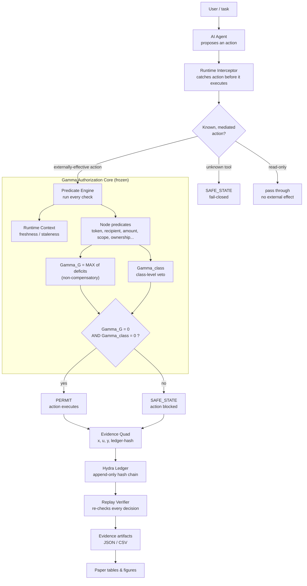
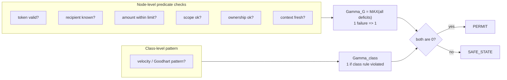
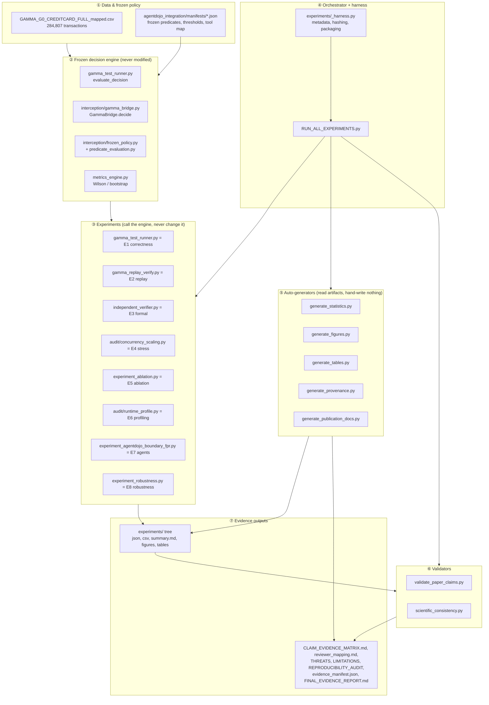
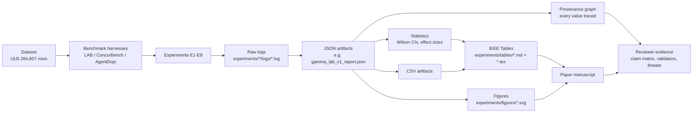
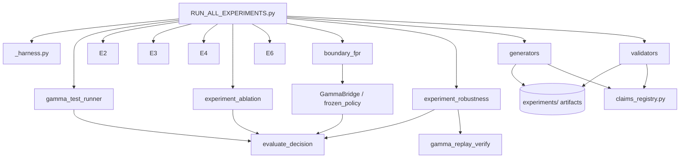

# ARCHITECTURE — How Everything Connects

Diagrams first, then a file-by-file map. All diagrams are Mermaid (they render on GitHub and in most
Markdown viewers).

---

## 1. The runtime authorization pipeline (what happens to one action)



**Read it as:** an action enters at the top, gets classified, runs through the predicate checks inside
Gamma, becomes **PERMIT** or **SAFE_STATE**, and — either way — is written to the tamper-evident ledger
that the replay verifier can later audit. Those audited records become the paper's numbers.

---

## 2. The two decision signals (why "one red flag = block")



The **MAX** (not average) is the whole point: averaging would let 5 good checks hide 1 bad one. With
MAX, a single deficit forces `Gamma_G = 1`, which blocks.

---

## 3. The whole repository, as layers



**Golden rule visible here:** layers ② (engine) and ① (frozen policy) are **never modified** by the
experiment or evidence layers. Experiments *call* the engine; generators *read* artifacts; validators
*check* consistency. This one-way flow is what makes the results reproducible and trustworthy.

---

## 4. The giant end-to-end diagram (dataset → reviewer evidence)



Every arrow is a real file dependency. Nothing skips a step: a number in the paper can always be walked
back **paper ← table ← JSON ← log ← experiment ← dataset**. The provenance graph
(`experiments/provenance/`) makes that walk-back machine-checkable.

---

## 5. Repository map (folder tree)

```
Independent Benchmark and Reviewer-Closure Framework for L-DREA/
│
├── GAMMA_G0_CREDITCARD_FULL_mapped.csv   ← the 451 MB transaction stream (input data)
├── gamma_replay_manifest.jsonl           ← 200 MB tamper-evident ledger (produced by E1)
│
├── gamma_test_runner.py        ← ★ FROZEN ENGINE. evaluate_decision(); runs E1 (LAB benchmark)
├── metrics_engine.py           ← statistics helpers (Wilson, bootstrap) — engine-adjacent, frozen
├── gamma_replay_verify.py      ← E2: independently re-verifies the ledger
├── independent_verifier.py     ← E3: exhaustive 2^16 equivalence check
├── experiment_ablation.py      ← E5: remove each component, measure leaked permits
├── experiment_robustness.py    ← E8: inject 16 fault types (NEW)
├── experiment_agentdojo_boundary_fpr.py ← E7: adjudicate AgentDojo attacks (no LLM)
│
├── concurbench_full.py, stress_test.py, fcr_test.py, full_spec_conformance.py
│                              ← supplementary conformance checks (run inside E1)
├── run_all.py                 ← OLDER "run everything" → HTML dashboard (gamma_report.html)
├── RUN_ALL_EXPERIMENTS.py     ← ★ NEWER "run everything" → experiments/ package (USE THIS)
│
├── validate_paper_claims.py   ← validator: every number consistent across JSON/table/figure/manifest
├── scientific_consistency.py  ← validator: 9 integrity checks (provenance, CIs, stale files...)
│
├── formal/                    ← ExternalizationMonitor.tla/.cfg (the TLA+ model for E3's TLC step)
│
├── agentdojo_integration/
│   ├── interception/          ← ★ the live authorization layer plugged into AgentDojo
│   │   ├── frozen_policy.py        (loads 7 immutable manifests, Merkle-root verified)
│   │   ├── gamma_bridge.py         (GammaBridge.decide → calls evaluate_decision)
│   │   ├── predicate_evaluation.py (turns env state into pass/fail predicates)
│   │   ├── execution_binding.py    (maps predicate families to engine slots)
│   │   └── governed_runtime.py     (the interception point; unknown tool → SAFE_STATE)
│   ├── manifests/             ← frozen policy JSON (predicates, thresholds, tool map, Merkle root)
│   ├── audit/                 ← analysis tools: concurrency_scaling (E4), runtime_profile (E6),
│   │                            stats_engine, fpr_fdr_labeling, replay_engine, _util (Wilson/bootstrap)
│   └── audit_run/trace/       ← 33 recorded AgentDojo episodes (used by E7, no LLM needed to re-derive)
│
├── runtime_context/           ← the "Runtime Context Layer": freshness/velocity/ordering OBSERVERS
│                                (they measure evidence but never decide — decisions stay in the engine)
│
├── experiments/               ← ★ THE REPRODUCIBLE EVIDENCE PACKAGE (produced by RUN_ALL_EXPERIMENTS)
│   ├── _harness.py                 (runs each experiment, records host/seed/time/sha256)
│   ├── claims_registry.py          (declares claims C1-C14 + reviewer concerns R1-R11)
│   ├── _evidence.py                (resolves claim → artifact → value, live)
│   ├── generate_statistics.py      (Wilson CIs, effect sizes)
│   ├── generate_figures.py         (pure-SVG figures — no matplotlib)
│   ├── generate_tables.py          (IEEE tables + LaTeX)
│   ├── generate_provenance.py      (the traceability graph)
│   ├── generate_publication_docs.py(claim matrix, reviewer map, threats, limitations, final report)
│   ├── runtime_correctness/  replay/  formal/  stress/  ablation/  profiling/  agentdojo/  robustness/
│   │                              ← one folder per experiment: logs, json, csv, summary.md, metadata.json
│   ├── figures/  tables/  statistics/  provenance/  _meta/
│   └── _meta/run_index.json        (the master record of the last full run)
│
└── docs/                      ← ★ THIS documentation set
```

The `★` items are the ones a newcomer touches first. Everything else is called *by* those.

---

## 6. Who calls whom (dependency direction)



Arrows point from "caller" to "callee/dependency." Notice the engine (`evaluate_decision`) is a **leaf**
— everything depends on it, it depends on nothing above it. That is by design.
