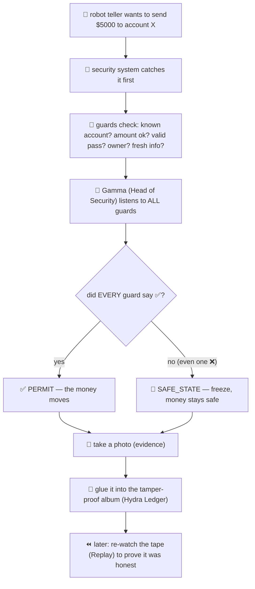

# BEGINNER GUIDE — Explained Like You're 10 (The Bank Analogy)

Imagine a **bank**. Inside the bank there's a super-fast robot teller (that's the **AI agent**). The robot
can do things with real money: send transfers, open accounts, change passwords. That's powerful — and a
little scary, because if someone tricks the robot, real money could leave the bank.

So the bank installs a **security system**. That security system is **L-DREA**. Here's every part of it,
as things you'd find in a real bank.

---

## 🧠 Gamma = the Head of Security

**Gamma** is the boss guard who makes the final "yes or no" call on every action.

The boss doesn't do the checking personally — the guards (predicates) do that. The boss just listens to
all the guards and follows one strict rule:

> **"If even ONE guard says something is wrong, the answer is NO."**

The boss never says "well, 9 guards are happy and only 1 is worried, so let's allow it." One worried guard
is enough to stop everything. (Grown-ups call this *non-compensatory* — you can't cancel out a bad thing
with good things.)

---

## 👮 Predicates = the individual guards, each with ONE job

Each **predicate** is a guard who checks exactly one thing and answers pass or fail:

- 👮 **Recipient guard:** "Do we actually know this account, or is it a stranger?"
- 👮 **Amount guard:** "Is this amount within what's allowed?"
- 👮 **Token guard:** "Does this person have a valid, un-expired pass?"
- 👮 **Owner guard:** "Does this person actually own this account?"
- 👮 **Freshness guard:** "Is our information up to date, or is it old/stale?"

Each guard just says ✅ or ❌. The boss (Gamma) collects all the answers.

---

## ✅ PERMIT = "Yes, you may do it"

**PERMIT** happens only when **every single guard says ✅**. Then the action actually executes — the money
really moves. PERMIT is *rare and special*: everything has to be perfect.

## 🛑 SAFE_STATE = "No — freeze, stay safe"

**SAFE_STATE** means "block it and don't do anything risky." This is the **default** answer. If any guard
is unhappy, or the guards aren't sure, or the information is stale — the answer is SAFE_STATE.

> The golden rule: **when in doubt, say NO.** It's much better to wrongly block a good action (annoying)
> than to wrongly allow a bad one (a robbery). Grown-ups call this **fail-closed**.

---

## 🚫 The Class-Level Veto = the guard who watches for sneaky patterns

Some clever thieves know how to make each *individual* check look fine, while the *overall pattern* is
clearly a robbery (like making 100 tiny transfers so no single one looks big). 

The **class-level veto** is a special guard who watches the *big picture*. Even if every small check
passes, this guard can shout "STOP — this whole pattern is a trick!" and force a SAFE_STATE. This stops
people from **gaming the system** (grown-ups call this Goodhart's law).

---

## 📸 Evidence = the security camera photo of every decision

Every time the boss makes a decision, the bank takes a **photo** that shows:
- what was asked (the request),
- what the boss decided (yes/no),
- what happened,
- and a special stamp.

Grown-ups call this photo an **evidence quad**. It means we can always look back and see *exactly* what
was decided and why.

## 🔗 The Hydra Ledger = the photo album where pages can't be swapped

All those photos go into a special **photo album (the Hydra Ledger)** where each page is **glued to the
one before it** with a secret code. If a thief tries to sneak out one photo or change it, the glue breaks
and everyone can tell. So the record can never be secretly edited. (This is the same trick a blockchain
uses.)

## ⏪ Replay = re-watching the tape to prove nothing was faked

**Replay** means: later, anyone can take the photo album and **re-play every decision** from the photos
alone — without asking the boss again — and get the *exact same answers*. If the re-play matches, we've
proven the decisions were honest, consistent, and un-tampered.

---

## Putting it together (the bank story)

---

## The one-sentence version

> **L-DREA is a bank security system for AI: many guards each check one thing, the head guard says "yes"
> only if everyone is happy (otherwise freeze), and every decision is photographed into a tamper-proof
> album that can be re-played later to prove nothing was faked.**

---

## A few grown-up words you'll now understand

| Kid word | Grown-up word | Means |
|----------|---------------|-------|
| Head of Security | **Gamma (Γ)** | the decision function |
| a guard | **predicate** | one pass/fail check |
| "yes, do it" | **PERMIT** | allow the action |
| "freeze, stay safe" | **SAFE_STATE** | block the action (the safe default) |
| the sneaky-pattern guard | **class-level veto** | blocks bad patterns even if each check passes |
| security photo | **evidence quad** | the record of one decision |
| tamper-proof album | **Hydra Ledger** | the chained, un-editable log |
| re-watch the tape | **replay** | re-verify decisions from the log alone |
| "when unsure, say no" | **fail-closed** | default to blocking |
| "one bad thing = stop" | **non-compensatory** | good checks can't cancel a bad one |

Now read **PROJECT_GUIDE.md** for the grown-up version, or **BEGINNER**-friendly **CHEATSHEET.md** for the
commands.
