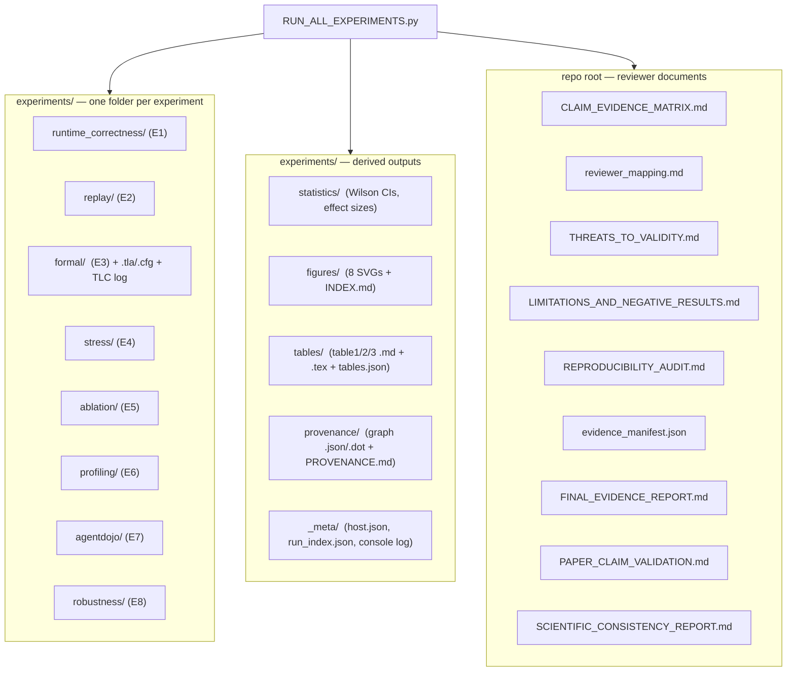

# EXPERIMENT GUIDE — Every Experiment & Every Generated File

There are **8 experiments (E1–E8)**. Each one is a self-contained question with a self-contained answer,
packaged into `experiments/<name>/`. This guide is the map of what each experiment asks, what it eats,
what it produces, and which reviewer worry it answers.

---

## 1. The 8 experiments at a glance

| # | Name | The question it answers | Input | Main output | Reviewer concern | Runtime | Rerunnable? |
|---|------|-------------------------|-------|-------------|------------------|---------|-------------|
| **E1** | Runtime Authorization Correctness | Does the guard authorize/deny correctly on a realistic stream? | ULB corpus (284,807 rows) | `gamma_lab_v1_report.json`, confusion matrix, `gamma_replay_manifest.jsonl` | "Is it correct on real data?" (R1) | ~12 s | ✅ yes |
| **E2** | Runtime Replay Integrity | Can every decision be re-verified from evidence alone? | the ledger from E1 | `replay_report.json` (0 failures, PASS) | "Is replay proven?" (R2) | ~1 s | ✅ yes |
| **E3** | Formal Verification | Is the decision logic provably correct over the whole input space? | none (enumerated) + `formal/*.tla` | `independent_verifier_report.json` (IDENTICAL) + TLC log | "Formal, not just tested?" (R3) | ~1 s | ✅ yes |
| **E4** | Runtime Stress | Does safety hold under concurrency, and how does it scale? | synthetic 200k-decision workload | `concurrency_scaling.json` (7 thread levels) | "Safe under load? Does it scale?" (R4, R5) | ~12 s | ✅ yes |
| **E5** | Component Ablation | Is every component necessary? | synthetic 60k-decision workload | `ablation.json` (leaked permits per removal) | "Over-engineered?" (R6) | ~2 s | ✅ yes |
| **E6** | Runtime Profiling | What is the per-stage overhead? | synthetic 5k-row workload + recorded traces | `runtime_profile.json`, `stage_distributions.json` | "What's the overhead?" (R7) | ~1 s | ✅ yes |
| **E7** | AgentDojo Governance | Does it stay sound on a third-party adversarial benchmark? | AgentDojo suites + 33 recorded episodes | `boundary_fpr.json`, `statistics.json` | "Generalizes to agents?" (R8) | ~2 s | ✅ (boundary, no LLM); ⛔ fresh episodes need Ollama |
| **E8** | Runtime Robustness | Does safety hold when the runtime misbehaves? | 16 injected fault scenarios | `robustness.json` (0 false permits, all hold) | "Behavior under faults?" (R9) | ~1 s | ✅ yes |

*Paper table/figure mapping:* E1 → Table I + `fig_authorization_accuracy` / `fig_false_permit_rate`;
E4 → Table II + `fig_latency` / `fig_throughput`; E5 → `fig_component_ablation`; E6 →
`fig_runtime_breakdown`; E8 → Table III + `fig_robustness`; E2 → `fig_replay_integrity`; E7 →
`fig_false_permit_rate`. E3 feeds Table I (formal rows).

---

## 2. Each experiment in a bit more depth

### E1 — Runtime Authorization Correctness
Feeds **every** ULB transaction through the frozen `evaluate_decision()`. The "labels" are the golden
trace's *expected authorization outcome* (not fraud labels). Produces the confusion matrix (TP/TN/FP/FN),
False-Permit Rate, False-Denial Rate, class-veto effectiveness, replay determinism, latency, and Wilson
confidence bounds. It also writes the 200 MB **replay manifest** (the ledger) that E2 audits.
*Headline result:* accuracy 1.000000, 0 false permits (0/492 should-deny), 0 false denials, 100% replay
determinism.

### E2 — Runtime Replay Integrity
Runs the independent `gamma_replay_verify.py` on the manifest. It re-derives the hash chain, checks each
record's ledger binding, and confirms self-consistency — **without** the dataset or the engine. If a
single byte were tampered, it would report a failure. *Headline result:* 284,807 records, 0 adjacency /
0 ledger-bind / 0 consistency failures → PASS.

### E3 — Formal Verification
Two independent proofs: (a) `independent_verifier.py` enumerates **all 2¹⁶ = 65,536** possible input
states and checks that a *separately written* reference decision function matches the engine on every one
(verdict IDENTICAL, 0 mismatches); (b) if Java is available, it model-checks the Appendix-D TLA⁺ spec
(`formal/ExternalizationMonitor.tla`) with TLC (no invariant violation over 40,192 reachable states).

### E4 — Runtime Stress
Drives 200,000 decisions per thread level at 1, 2, 4, 8, 16, 32, 64 threads. Records throughput, latency
percentiles, queue delay, CPU, memory, and — most importantly — safety (false permits/denials, ledger
consistency) at each level. *Headline result:* **0 false permits / 0 false denials at every level**, but
**throughput degrades** (GIL-bound) — reported honestly as a limitation, not a scaling win.

### E5 — Component Ablation
Removes one control at a time and counts "leaked permits" (denials that removal turns into permits):
removing the class-veto or the non-compensatory Γ each leaks 15,000/60,000; removing the authorization
layer leaks 45,000/60,000. This is the **causal** evidence that each component matters.

### E6 — Runtime Profiling
Times the Runtime-Context plane and the Replay plane against the full pipeline (synthetic 5k rows), and
pulls per-stage distributions (predicate eval, Γ, tool execution) from the recorded AgentDojo traces.
*Headline:* Runtime-Context ≈ 7%, Replay ≈ 4% of end-to-end.

### E7 — AgentDojo Governance
Two no-LLM parts: (a) re-derive permit/deny/stability/overhead from the **33 recorded** episodes; (b)
the **boundary probe** — take every real AgentDojo injection attack's target and submit the corresponding
action straight to the frozen boundary, measuring whether any genuinely-foreign attacker target is
permitted. *Headline:* **0/62 false permits** on foreign targets. Fresh end-to-end episodes (Utility /
attack-success rate) need Ollama and are the one BLOCKED item.

### E8 — Runtime Robustness *(the newest experiment)*
Injects **16 fault families** *only into the harness* (the engine is untouched): missing / delayed /
corrupted / conflicting predicates, stale context, missing auth context, clock skew, network delay,
timeout, partial system failure, predicate races, and — via a mutated ledger slice handed to the stable
verifier — replay corruption, ledger corruption, partial loss, reordering, duplication. Safety property:
decision-path faults must fail closed (0 false permits); integrity faults must be *detected*.
*Headline:* 16/16 families hold, 0 false permits across 51 trials, every corruption detected.

---

## 3. Older / supplementary tests (run inside E1 or the dashboard)

| Test | What it checks | Where it runs |
|------|----------------|---------------|
| **ConcurBench** (`concurbench_full.py`) | L1–L4 conformance: authorization correctness, adversarial robustness, distributed consistency, replay/audit. | inside E1 and `run_all.py` |
| **Stress scenarios** (`stress_test.py`) | Financial adversarial scenarios (ghost transfer, sanctions drift, liquidity panic, sovereign edge). | inside E1 and `run_all.py` |
| **Fail-Closed Rate** (`fcr_test.py`) | Every uncertain/should-deny family fails closed (rate = 1.0). | inside E1 and `run_all.py` |
| **FULL_SPEC** (`full_spec_conformance.py`) | Acceptance bands, AIS, three-signal closure — produces the confusion matrix. | inside E1 and `run_all.py` |

---

## 4. Part 9 — What new files appear after a full run

### What's inside every `experiments/<name>/` folder
| File | Meaning |
|------|---------|
| `logs/<Ex>.log` | the raw terminal output of that experiment (the "raw log" in provenance) |
| `*.json` | the machine-readable results (the numbers) |
| `*.csv` | the same results in spreadsheet form |
| `summary.md` | a human-readable one-page summary |
| `metadata.json` | host, git commit, seed, timestamp, runtime, and SHA-256 of each artifact |
| `REPRODUCE.md` | the exact command to reproduce just this experiment |

### The derived folders
| Folder | Meaning |
|--------|---------|
| `experiments/statistics/` | confidence intervals, zero-event bounds, effect sizes, sensitivity |
| `experiments/figures/` | the 8 publication figures (`fig_*.svg`) + `INDEX.md` |
| `experiments/tables/` | IEEE tables in Markdown **and** LaTeX, plus `tables.json` |
| `experiments/provenance/` | the traceability graph (`.json`, `.dot`) + human-readable `PROVENANCE.md` |
| `experiments/_meta/` | `host.json`, `run_index.json` (master record), `RUN_ALL_console.log` |

### The reviewer documents (repo root)
See **PROJECT_GUIDE.md §7** and **CHEATSHEET.md**. In short: the claim matrix maps claims → evidence, the
reviewer mapping answers anticipated criticisms, threats/limitations disclose weaknesses, the
reproducibility audit + evidence manifest give checksums and commands, and the two `*_VALIDATION*` /
`*_CONSISTENCY*` files are the automated PASS/FAIL audits.

---

## 5. Where the older/other outputs live (if you run `run_all.py`)

| Output | Meaning |
|--------|---------|
| `gamma_report.html` | the interactive dashboard (LAB + ConcurBench + stress + FCR + FULL_SPEC) |
| `gamma_lab_v1_report.json` | the LAB benchmark results (same file E1 uses) |
| `concurbench_full_report.json`, `stress_test_report.json`, `fcr_test_report.json`, `full_spec_conformance_report.json` | the supplementary suite results |
| `fresh_evidence/ablation/`, `fresh_evidence/robustness/` | where E5 and E8 write their raw outputs before RUN_ALL copies them into `experiments/` |
| `agentdojo_integration/audit_run/` | the 33 recorded AgentDojo episodes + summaries (used by E7) |
