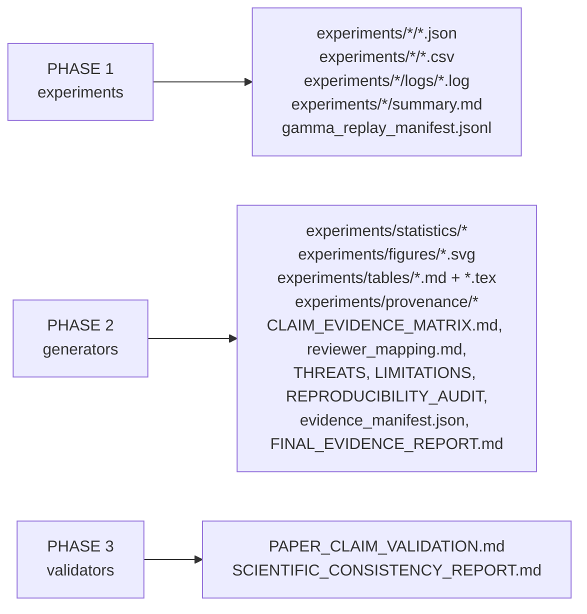
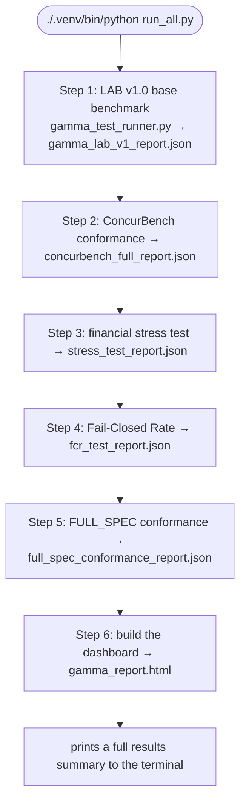
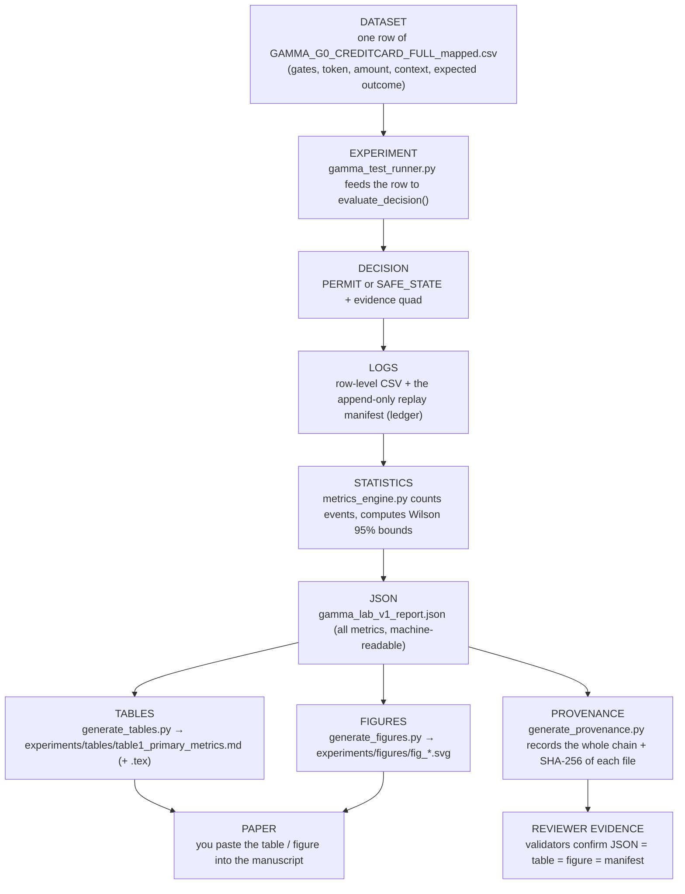
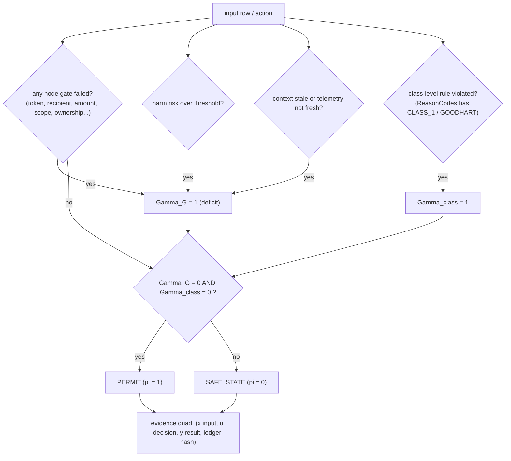

# FLOWCHARTS — What Actually Happens, Step by Step

Two flows matter most: (1) what happens when you run the main command, and (2) how a dataset row turns
into a number in the paper.

---

## 1. What happens when you type `RUN_ALL_EXPERIMENTS.py`

```mermaid
flowchart TD
    START(["you run:<br/>./.venv/bin/python RUN_ALL_EXPERIMENTS.py"]) --> META[capture host info<br/>CPU, RAM, Python, git commit, seed, timestamp<br/>→ experiments/_meta/host.json]
    META --> E1

    subgraph PHASE1["PHASE 1 — run the 8 experiments in order"]
      E1[E1 correctness<br/>gamma_test_runner on 284,807 rows] --> E2[E2 replay<br/>verify the ledger]
      E2 --> E3[E3 formal<br/>2^16 check + TLC]
      E3 --> E4[E4 stress<br/>1-64 threads]
      E4 --> E5[E5 ablation<br/>remove components]
      E5 --> E6[E6 profiling<br/>per-stage timing]
      E6 --> E7[E7 AgentDojo<br/>boundary FPR, no LLM]
      E7 --> E8[E8 robustness<br/>16 fault types]
    end

    E8 --> PACK[each experiment writes into experiments/&lt;name&gt;/:<br/>logs/  ·  *.json  ·  *.csv  ·  summary.md  ·  metadata.json  ·  REPRODUCE.md]
    PACK --> IDX[write experiments/_meta/run_index.json<br/>master record of the run]

    IDX --> GEN
    subgraph PHASE2["PHASE 2 — generators (read artifacts only)"]
      GEN[generate_statistics.py] --> GF[generate_figures.py]
      GF --> GT[generate_tables.py]
      GT --> GP[generate_provenance.py]
      GP --> GD[generate_publication_docs.py]
    end

    GD --> VAL
    subgraph PHASE3["PHASE 3 — validators"]
      VAL[validate_paper_claims.py<br/>every number consistent?] --> SC[scientific_consistency.py<br/>9 integrity checks]
    end

    SC --> DONE(["DONE — prints a summary table:<br/>E1..E8 EXECUTED, validators PASS"])
```

**In words:** it records *where and when* it ran, runs all 8 experiments (each one packaged into its own
folder), writes a master index, then the generators turn those artifacts into statistics, figures,
tables, a provenance graph, and all the reviewer documents, and finally two validators confirm every
number is consistent and every chain unbroken. If anything fails, it says so — it never invents a value.

### What files appear, by phase

---

## 2. What happens when you type `run_all.py` (the older dashboard suite)

Use this when you want the **interactive HTML dashboard**. Use `RUN_ALL_EXPERIMENTS.py` when you want the
**reproducible reviewer package**.

---

## 3. How a dataset row becomes a paper number (the traceability chain)

**Why this matters:** a reviewer can pick any number in the paper and follow the arrows *backwards* all
the way to a raw dataset row and the exact command that produced it. There is no step where a human types
a number by hand — the generators read the JSON and format it, and the validators prove the formatted
value equals the JSON value.

---

## 4. Inside one decision (the engine's own mini-flow)

This is exactly what `evaluate_decision()` does for every single action — deterministically, with no
randomness, which is why replay always reproduces it.
