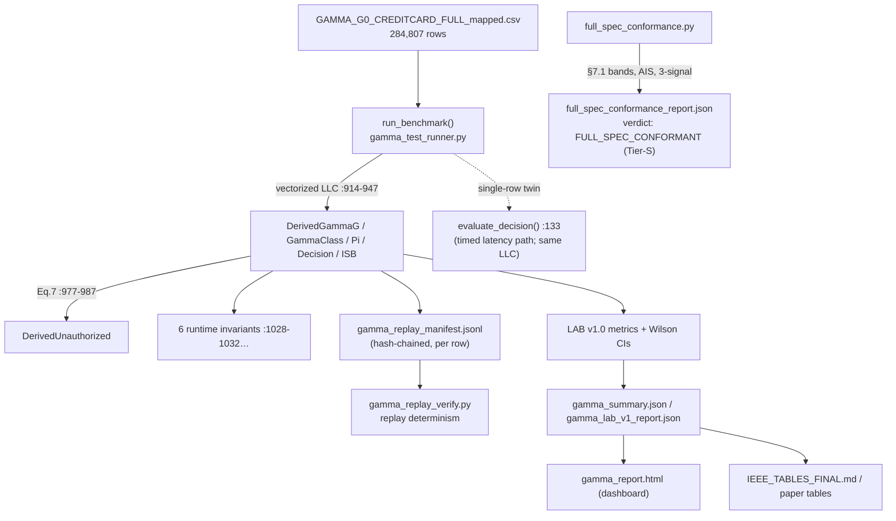
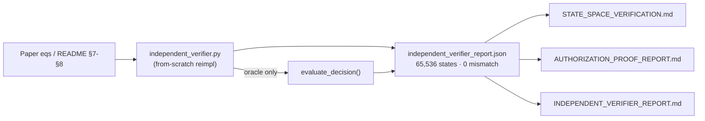
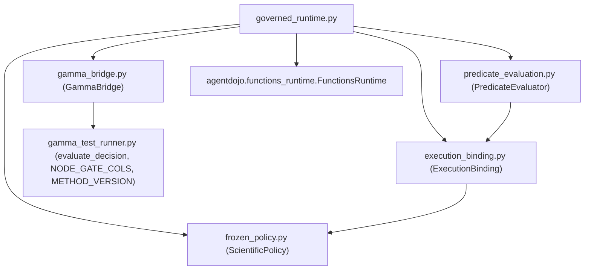

# IMPLEMENTATION_GRAPH.md

**Phase 3 — Part F: implementation dependency graph.**
Every edge below was confirmed from actual `import` statements / call sites (read-only).

---

## F1. Runtime authorization dataflow (AgentDojo → Decision → Evidence)

```mermaid
flowchart TD
    ADJ["AgentDojo agent + task suite"] -->|tool call| RF["GammaGovernedRuntime.run_function()<br/>governed_runtime.py:50"]
    RF -->|classify| SP["ScientificPolicy.classify()<br/>frozen_policy.py:74<br/>(7 frozen manifests, root ce8c8467…)"]
    SP -->|mediated? eea_class? families?| RF
    RF -->|unknown class| DENYU["_deny → SAFE_STATE<br/>(fail closed, Def 2i / §0.10)"]
    RF -->|not mediated| PASS["super().run_function()<br/>read-only passthrough (Def 1)"]
    RF -->|mediated: families,args,env| PE["PredicateEvaluator.evaluate()<br/>predicate_evaluation.py:120"]
    PE -->|reads status/threshold| EB["ExecutionBinding<br/>execution_binding.py<br/>(binding sha a3861927…)"]
    PE -->|deficits {family:0/1}| BR["GammaBridge.decide()<br/>gamma_bridge.py:30"]
    BR -->|family→gamma_slot| EB
    BR -->|engine row| ED["evaluate_decision()<br/>gamma_test_runner.py:133<br/>(THE single LLC engine)"]
    ED -->|Γ_G, Γ_class, Π, decision| BR
    BR --> DEC{"decision == PERMIT ?"}
    DEC -->|PERMIT| EXEC["super().run_function() → execute"]
    DEC -->|SAFE_STATE| DENYM["_deny → SAFE_STATE denial"]
    RF -->|append per decision| LOG["gamma_decisions[] evidence log<br/>governed_runtime.py:57,69"]
    LOG --> EEB["Execution Evidence Bundle<br/>runtime_context/execution_evidence_bundle.py"]
```

**Key architectural facts (verified):**
- `gamma_bridge.py:19` — `evaluate_decision = _gamma.evaluate_decision` (imported, **not** reimplemented).
- `ScientificPolicy` and `ExecutionBinding` are **injected** into `GammaGovernedRuntime.__init__` (dependency inversion; `governed_runtime.py:32-38`).
- Provenance chain: `ExecutionBinding.derived_from_scientific_root` must equal `ScientificPolicy` root `ce8c8467…` or load fails.

## F2. Batch / benchmark + replay + paper-tables dataflow



## F3. Verification overlay (this Phase-3 package)



## F4. Module import graph (interception package — verified from `import` lines)



## F5. Linear dependency spine (as requested by the prompt)

```
AgentDojo
  → GammaGovernedRuntime.run_function            (governed_runtime.py:50)
    → ScientificPolicy.classify                  (frozen_policy.py:74)     [7 frozen manifests]
    → PredicateEvaluator.evaluate                (predicate_evaluation.py:120)
      → ExecutionBinding (status/threshold/slot)  (execution_binding.py)
    → GammaBridge.decide                         (gamma_bridge.py:30)
      → evaluate_decision                        (gamma_test_runner.py:133)   [THE engine]
        → Γ_G, Γ_class, Π → decision
    → PERMIT (execute) / SAFE_STATE (deny)
    → gamma_decisions[] evidence                 (governed_runtime.py:57,69)
      → Execution Evidence Bundle → replay manifest → paper tables
```

**Single-engine property (graph-level):** every decision edge terminates at the *one*
`evaluate_decision` node. No parallel authorization engine exists in the graph — statically
enforced by `tools/check_single_engine.py`.
